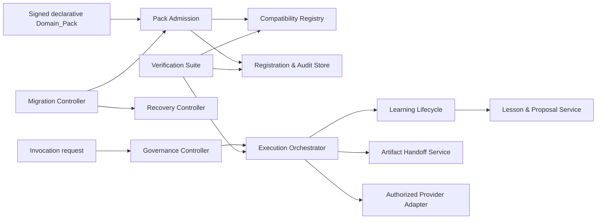

# Technical Design: Adoption Redesign

## Overview
The Adoption_Platform is a domain-neutral, fail-closed control plane for immutable declarative Domain_Packs. This design implements only the approved behavior in [requirements.md](requirements.md): `va-agent-swarm` remains the canonical VA owner; the platform stores validated versioned references and enforces common registration, execution, learning, migration, compatibility, provider, verification, and recovery controls for every domain.

Implementation context: the existing backend is Python 3.12/FastAPI and already pins Hypothesis for property tests in [`backend/pyproject.toml`](../../../backend/pyproject.toml). That fact selects test tooling only; all feature behavior, decisions, and scope below derive from the approved requirements.

**Design decisions.** Accept Domain_Packs as data-only, content-addressed declarations; separate authorization decisions from durable audit writes so explicitly stated audit-write failures cannot weaken a denial; record state transitions as immutable, correlation-linked evidence; and implement governance as a mandatory precondition rather than a best-effort observer. These choices directly support Requirements 1–9.

## Architecture

The control plane owns admission, policy decisions, lifecycle state, evidence, and availability; a Domain_Pack owns domain declarations and immutable referenced assets. All state-changing requests carry a correlation identifier and are mediated by the Governance_Controller. Provider calls are invoked only through authorized capability-scoped adapters. The platform uses transactions or an equivalent atomic compare-and-set for state transitions; audit persistence is deliberately independent where the requirements explicitly permit the primary denial/rejection to complete if its audit write fails.

## Components and Interfaces

| Component | Interface and responsibilities |
| --- | --- |
| Pack Admission | `register(pack, signer, correlationId) -> RegistrationResult`; validates Pack_Contract fields, digest, declarative-only content, VA extension schemas, policies, and compatibility; writes registration or a best-effort rejection audit. |
| Compatibility Registry | `evaluate(packRange, supportedHost, supportedAlc) -> CompatibilityStatus`; records compatible only on range intersection and is queried before activation or invocation. |
| Invocation & Execution Orchestrator | `beginInvocation(association) -> Result<Run>` persists the required association before any node starts; `execute(run)` enforces declared budget, rollback, approval, and memory policies. |
| Governance Controller | `authorizeDataAccess`, `authorizeTool`, `authorizeOutbound`, `authorizeProvider`, and `applyCapacityAction`; evaluates every declared scope/capability and returns typed allow/deny outcomes with best-effort audit emission. |
| Artifact Handoff Service | `createInternal` and `submitExternal`; persists immutable lineage/owner/classification/integrity/approval/provenance metadata and exposes availability only at the specified completion barrier. |
| Learning Lifecycle | `evaluateActivation`, `suspendForChange`, `recordRetrieval`, and `recordTerminalEpisode`; enforces one effective ALC, pre-action retrieval evidence, and exactly-one immutable terminal episode. |
| Lesson & Improvement Service | `assessLesson`, `revokeLesson`, `linkOutput`, `createProposal`, and `promoteProposal`; controls scoped retrieval, audit-gated revocation, sandbox-only evolution, reviewer promotion, and rollback provenance. |
| Migration, Verification & Recovery | `startPhase`, `evaluateActivationEligibility`, `rollback`, `verifyRelease`, and `recover`; retain evidence before irreversible transitions and publish compatibility/release decisions. |

All commands return an explicit `Allowed`, `Denied(reason)`, `Blocked(reason)`, or `FailedRecoverable(reason)` result; callers cannot treat an unavailable dependency or incomplete evidence as an allow. Repository and provider interfaces accept structured identifiers and never interpolate untrusted identifiers into paths or queries.

## Data Models

- **Versioned declarations:** `DomainPack {packId, immutableVersion, digest, signerId, hostRange, alcRange, agents, workflows, capabilities, classifications, evaluationRefs, assetRefs}`; `Registration {packId, version, digest, signerId, ranges, validation, decision, compatibilityStatus}`; and independently versioned `HostContract` and `AgentLearningContract` (ALC).
- **Execution and access evidence:** `InvocationAssociation {organizationId, domainId, packVersion, agentId, workflowId, runId, correlationId}`; `AuthorizationDecision`; immutable `AuditRecord`; and `ArtifactHandoff {lineage, owner, classification, integrityRef, approvalRef, provenanceRef, availability}`.
- **Learning evidence:** `RetrievalRecord {attemptId, approvedFilters, lessonRefs}` (including empty refs); immutable `LearningEpisode {attemptId, terminalOutcome, ...}` with a unique `attemptId`; versioned `Lesson {assessment, retrievalScope, retrievable}`; `ImprovementProposal {evidenceRefs, sandboxState, promotion, rollbackRef}`.
- **Lifecycle, release, and recovery evidence:** `AgentLifecycle`, `WorkflowActivation`, `MigrationPhase`, `SourceIndexEntry`, `CompatibilityStatus`, `VerificationRun`, `ReleaseReadinessDecision`, `RecoveryAction`, and independent `MaturityState` per agent.

All immutable evidence records include an ID, creation timestamp, actor or service identity, correlation ID where applicable, and references rather than duplicated sensitive content. Composite uniqueness protects `(packId, immutableVersion)`, `(attemptId)` for Learning_Episode, and a terminal decision per release evaluation. Artifact lineage is a directed acyclic graph enforced before persistence.

## Correctness Properties

*A property is a characteristic or behavior that should hold true across all valid executions of a system—essentially, a formal statement about what the system should do. Properties bridge human-readable specifications and machine-verifiable correctness guarantees.*

### Consolidation reflection
The prework identifies broad generated-input logic in admission, scope authorization, handoff state, learning lifecycle, lessons, migration, compatibility, providers, verification, recovery, and capacity. Redundant candidate checks were consolidated: admission rejection, policy rejection, and success-record preservation are one decision property; all learning activation branches are one state-machine property; external handoff confirmation and premature availability are one availability-barrier property; compatibility intersection and its activation/invocation guards are one property; and verification release decisions preserve completed coverage within one property. Audit-event shapes, fixed workflows, load proof, and provider/VA end-to-end wiring remain example or integration tests because repeated random inputs do not add proportional confidence.

### Property 1: Admission is a complete, fail-closed decision
For any submitted Domain_Pack and applicable Registration_Policies, registration is approved and persists a record preserving its required identity, immutable version, digest, signer, ranges, validation result, and decision if and only if every required Pack_Contract field validates and every applicable policy passes; otherwise it is rejected.

**Validates: Requirements 1.2, 1.3, 1.4, 1.7**

### Property 2: Invocation association is an execution barrier
For any Invocation association, the orchestrator starts an agent node only after it has persisted the organization, domain, pack version, agent, workflow, run, and correlation identifiers; any persistence failure yields a denial and no node start.

**Validates: Requirements 1.8, 1.9**

### Property 3: VA packages retain declarative, reference-only safety
For any VA_Domain_Pack, a registration record contains only validated versioned asset references and digests; detection of executable package code during validation rejects the pack; and an Artifact_Handoff extension is accepted if and only if its metadata validates against the registered VA extension schema.

**Validates: Requirements 2.2, 2.4, 2.8, 2.9**

### Property 4: Data access remains within every declared scope
For any access request and registered declaration, access is allowed only when organization, domain, supported pack-version range, agent, and memory scope all match approved values; changing an approved request to a cross-organization, cross-domain, or undeclared memory scope always produces a denial.

**Validates: Requirements 3.1, 3.2, 7.3**

### Property 5: Undeclared capabilities cannot escape governance
For any declared tool and outbound-destination allow-lists, every request for an identifier or destination absent from its respective declaration is denied.

**Validates: Requirements 3.5, 3.7**

### Property 6: Artifact availability follows complete, acyclic evidence
For any generated acyclic handoff lineage and required metadata, internal handoffs persist every required reference before becoming available at creation completion, while externally submitted handoffs remain unavailable until metadata persistence is confirmed; any premature external availability is revoked and no cyclic lineage is persisted.

**Validates: Requirements 3.9, 3.10, 3.11, 3.12, 3.13, 7.1, 7.3**

### Property 7: Declared workflow policies are enforced at every action
For any registered workflow and attempted action, a breach of its declared budget, rollback, approval, memory-read, or memory-write policy prevents completion or triggers the declared rollback behavior; no policy-breaching action is treated as authorized.

**Validates: Requirements 3.15**

### Property 8: Learning-agent activation is atomic and evidence-complete
For any learning-required agent, candidate ALC set, lifecycle state, and lifecycle-affecting change, the agent becomes active only when exactly one effective ALC names it and all required memory, retrieval, episode-capture, reflection, retention, and version evaluation conditions pass; changes suspend an active agent first, and every failed initial or post-change evaluation leaves it non-active.

**Validates: Requirements 4.1, 4.2, 4.3, 4.4, 4.5, 4.6, 7.3**

### Property 9: Retrieval evidence precedes learning-required execution
For any learning-required node attempt and approved filter set, exactly one Retrieval_Record, including an empty lesson result when appropriate, is persisted before action execution; a retrieval-record persistence failure blocks the action.

**Validates: Requirements 4.7, 4.8**

### Property 10: Terminal learning outcomes are immutable and recoverable
For any learning-required Agent_Node_Attempt that reaches one or more terminal notifications, the platform persists exactly one immutable Learning_Episode for the attempt; if that persistence fails, the attempt is marked blocked for recovery.

**Validates: Requirements 4.10, 4.11**

### Property 11: Lesson assessment and retrieval enforce complete scope
For any candidate Lesson, it becomes retrievable only when its format, source episode references, safety policy, domain policy, and threshold all pass, and then only for requests satisfying every approved organization, domain, pack-version, agent, and memory-scope filter; any failed assessment criterion makes it non-retrievable through standard retrieval.

**Validates: Requirements 5.1, 5.2, 5.3**

### Property 12: Revocation changes retrieval only after auditable commitment
For any retrievable Lesson and subsequent request, it is excluded from future retrieval after its revocation Audit_Record persists, while an unpersisted revocation request leaves its prior retrieval eligibility unchanged.

**Validates: Requirements 5.5, 5.6**

### Property 13: Output provenance is complete without inventing retrieval
For any output and its source Learning_Episodes, the output links to its Retrieval_Record when one exists and to every source episode of each retrieved Lesson; when no Retrieval_Record exists, linking the provided source episodes still succeeds without creating a false retrieval link.

**Validates: Requirements 5.7, 5.8**

### Property 14: Learning observability preserves counts while redacting content
For any collection of episodes, assessed/retrieved/stale/revoked Lessons, assessment outcomes, and escalations, a per-agent observability projection reports the exact required counts and never includes sensitive Lesson content.

**Validates: Requirements 5.9**

### Property 15: Improvement remains sandboxed until governed promotion
For any repeated-failure evidence satisfying an ALC improvement policy, the platform creates an Improvement_Proposal with its evidence before a sandbox transition, preserves failure evidence if that transition fails, denies every live-change target while promotion approval is absent, and records immutable replacement/promoted versions plus rollback reference when an approved proposal is promoted.

**Validates: Requirements 5.10, 5.11, 5.12, 5.14, 7.3**

### Property 16: Frozen VA inventory and roster evidence are complete
For any frozen VA source inventory, registration preparation succeeds only when each asset has hash, owner, license-or-consent classification, and disposition, and when a 114-agent indexed roster has exactly one VA_Domain_Pack mapping per agent.

**Validates: Requirements 6.2, 6.3, 6.4**

### Property 17: VA activation eligibility cannot bypass evidence or approval
For any VA workflow evidence vector, the workflow is Activation_Eligible if and only if declared evaluations, reproducible trace, applicable human approvals, maturity, and designated approval evaluation all pass; an absent/pending explicit activation approval or an ineligible state always prevents active transition.

**Validates: Requirements 6.5, 6.6, 6.7**

### Property 18: Approved rollback restores the designated version and retention outcome
For any approved migration rollback target and affected Lessons, the Migration_Controller restores exactly the designated immutable VA_Domain_Pack version and applies the ALC-selected retention behavior to every affected Lesson.

**Validates: Requirements 6.8, 6.9**

### Property 19: Release decisions respect coverage state and preserve evidence
For any verification result sequence, a failure after completed integration coverage produces a failed Release_Readiness_Decision while preserving the completed coverage result; a failure before integration coverage completes continues verification without producing that failed decision.

**Validates: Requirements 7.7, 7.8, 7.10**

### Property 20: Compatibility is intersection-based and blocks use when incompatible
For any independently versioned Domain_Pack, Host_Contract, and ALC ranges, the recorded Compatibility_Status is compatible exactly when the pack range intersects both supported ranges; an incompatible status prevents both active transition and every Invocation submission, and each designated supported version combination is recorded in the compatibility matrix.

**Validates: Requirements 7.12, 8.2, 8.3, 8.4, 8.5**

### Property 21: Contract-breaking approval requires complete evidence
For any proposed contract-breaking change, Migration_Controller approval occurs if and only if its change-evidence record has an architecture decision record, migration plan, consumer compatibility evidence, deprecation window, and rollback plan.

**Validates: Requirements 8.6, 8.7**

### Property 22: Provider authorization and failures fail closed
For any Provider_Adapter declaration and provider outcome, authorization is granted only when explicit capability, cost, retention, residency, and safety declarations are all present; a missing declaration/field or timeout, unsafe result, budget exceedance, or unavailability always denies the affected external action.

**Validates: Requirements 8.8, 8.9, 9.1**

### Property 23: Domain onboarding requires admission evidence
For any new-domain onboarding declaration, the Domain_Pack is activation-eligible only if it is Pack_Contract-valid and declares evaluation references.

**Validates: Requirements 8.12**

### Property 24: Video releases fail closed on every mandatory gate
For any video Artifact_Handoff gate set, omission of any rights, consent, continuity, media-quality, channel, or approval gate produces a blocked Release_Readiness_Decision.

**Validates: Requirements 9.3**

### Property 25: Recovery is evidence-gated and target-exact
For any approved Recovery_Action, restoration occurs only after prior-version investigation evidence persists and restores exactly the designated immutable Domain_Pack version; if required evidence persistence fails, restoration does not occur.

**Validates: Requirements 9.4, 9.5, 9.6**

### Property 26: Operational containment preserves independent maturity evidence
For any pack exceeding its approved load limit, the Governance_Controller applies exactly its approved throttle-or-disable action; if a Provider_Adapter failure disables the pack, each agent retains its prior independent Maturity_State.

**Validates: Requirements 9.8, 9.9**

## Security and Governance Controls

- **Admission integrity:** verify the declared immutable version, content digest, signer identity, Pack_Contract, compatibility range, and declarative-only package rule before a registration can succeed. The VA registry normalizes asset references and digests rather than ingesting package-owned executable code or copied asset content.
- **Tenant and capability isolation:** authorize each data request against organization, domain, supported pack range, agent identity, and declared memory scope; deny cross-boundary access, undeclared tools, and undeclared outbound destinations. Enforcement occurs before returning data or initiating an external action.
- **Provider and workflow containment:** use capability-scoped Provider_Adapters only after complete provider declarations; deny unsafe, unavailable, over-budget, and timeout outcomes. Enforce every workflow's declared budget, approvals, rollback, and memory policy at execution boundaries; capacity actions are policy-selected, auditable containment actions.
- **Evidence integrity and minimization:** persist immutable, correlation-linked registrations, invocation associations, retrievals, episodes, handoffs, decisions, and recovery evidence. Handoff lineage is acyclic, external handoffs remain unavailable until metadata confirmation, and observability exposes aggregate counts without sensitive Lesson content.
- **Human governance:** require designated approval for VA activation, live Improvement_Proposal promotion, migration rollback, and recovery. Improvements remain sandbox-only until assessed evidence and reviewer approval are recorded, with immutable rollback references.
- **Audit behavior:** audit every required governed denial, block, revocation, capacity action, promotion, and rejection. Where the requirements permit audit persistence failure, preserve the primary fail-closed decision and continue only the explicitly allowed operation; revocation is deliberately different and takes effect only after its audit record persists.

## Error Handling

All command handlers produce typed, non-sensitive outcomes and retain the correlation identifier. Input validation errors identify failed categories or schema locations by reference, not secret or Lesson body content. Clients receive a denial/blocked result; detailed decision evidence remains in authorized audit and verification projections.

| Condition | Required recovery behavior |
| --- | --- |
| Pack validation/policy/executable-code failure | Reject registration. Attempt the required audit; an audit write failure does not convert rejection into approval. |
| Invocation association or Retrieval_Record write failure | Deny/block before the node executes; attempt required audit. |
| Learning_Episode write failure | Mark the terminal attempt blocked for recovery; do not fabricate an episode. |
| External handoff metadata pending or premature availability | Withhold downstream access; revoke premature availability and audit the revocation. |
| Lesson revocation audit write failure | Retain prior retrievability; do not apply revocation until audit commitment succeeds. |
| Provider fault or undeclared provider/capability | Deny the external action; preserve the denial even if its audit write fails. |
| Verification failure-record write failure | Continue remaining verification steps; retain all independently persisted coverage evidence. |
| Compatibility failure | Record incompatible status and prevent activation and invocations until supported ranges intersect. |
| Migration/recovery evidence write failure | Halt rollback/recovery before restoration. |
| Capacity exceedance | Apply the declared throttle-or-disable action and emit required audit evidence. |

Recovery workers are idempotent by immutable record ID and correlation ID: retries may finish a previously failed durable write but must not create duplicate Learning_Episodes, duplicate terminal release decisions, or a second restoration for the same completed Recovery_Action.

## Testing Strategy

Property-based testing is appropriate because this feature contains pure or fake-backed decision engines with large input spaces: manifest validation, range compatibility, authorization scope containment, lifecycle transitions, evidence ordering, graph acyclicity, policy gates, and release decisions. Use the existing `hypothesis==6.131.12` dependency with `pytest`; each property above is one test configured with `@settings(max_examples=100, deadline=None)`, bounded generators, deterministic fakes for repositories/adapters, and a comment in this exact form: `Feature: adoption-redesign, Property N: <property title>`.

- **Schema and focused unit tests:** deterministically test Pack_Contract and handoff-lineage schemas; lifecycle/ALC/lesson/provider allow-list branches; audit event payloads; audit-write edge cases; canonical VA ownership; distinct maturity values; and administrative failure decisions. These cover the EXAMPLE and EDGE_CASE classifications from prework.
- **Property tests:** implement Properties 1–26 in `backend/tests/properties/`; use generated declarations, version ranges, policy vectors, lineages, and event sequences. Include explicit seeds/examples for minimal boundary cases (empty retrieval, missing one gate, zero/multiple ALCs, 114 mapping cardinality, and incomplete coverage). No property test contacts a real provider or production persistence store.
- **Integration tests:** run against isolated repositories and only authorized mock Provider_Adapters. Cover superseded-version reproduction, rollback evidence retention, two non-video packs using shared patterns, the 24-pack load proof, VA graph/retrieval/episode/reflection/approval/release path, fixed-seed initial VA vertical artifacts, and the separate named security-attack denial/audit fixtures.
- **Release evidence:** record deterministic schema/unit/property/integration outputs, fixed seeds, fixture digests, compatibility-matrix results, Audit_Records, and UI projections as Verification_Suite evidence. Evaluate release decision semantics independently from whether failure-record persistence succeeds.
- **Validation commands:** because this change adds only the design document, validate the spec document format with workspace diagnostics. Future implementation changes should run focused quiet tests such as `python -m pytest tests/properties -q`, then the affected integration subset with `-q`, plus configured static analysis; the SDD gate must record those commands and results before release submission.

## Requirement Traceability

The components and properties above collectively cover Requirements 1–9. Acceptance criteria classified as EXAMPLE, EDGE_CASE, or INTEGRATION in the recorded prework are intentionally handled by the corresponding deterministic, resilience, mock-provider, load, or end-to-end test layer rather than forced into property tests. No behavioral requirement has been added or modified.