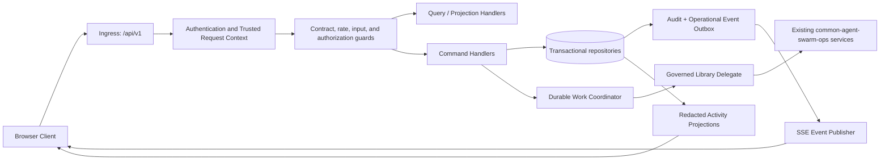

# Technical Design: Backend Redesign

**Status:** Proposed design — requirements-first

## Overview

Backend_Redesign is an additive, browser-facing control-plane façade over the existing `common-agent-swarm-ops` library. It exposes only versioned `/api/v1` contracts and authorized redacted projections. The browser never receives execution authority, credentials, raw prompts, protected artifacts, provider internals, repository access, or client-derived organization/actor authority.

The design makes every protected command tenant-scoped through a server-derived `Trusted_Request_Context`, makes every state change idempotent and auditable, and records durable work before dispatch. The façade validates and persists control-plane state; workers delegate all governed execution, including inline dispatch, through existing library services. It therefore adds no parallel workflow, tool, approval, validation, cancellation, recovery, or event engine.

### Research findings informing this design

The existing FastAPI host already restricts public paths to `/api/v1` ([`backend/app/main.py`](../../../backend/app/main.py)) and composes versioned routers ([`backend/app/api/v1/router.py`](../../../backend/app/api/v1/router.py)). Its request dependency accepts only server-set identity context ([`dependencies.py`](../../../backend/app/api/v1/dependencies.py)); `ControlPlaneServices` demonstrates tenant-scoped service delegation and existing governance/tool-broker seams ([`services.py`](../../../backend/app/api/v1/services.py)). The codebase has strict Python typing and pinned `fastapi`, `pytest`, and `hypothesis` versions ([`backend/pyproject.toml`](../../../backend/pyproject.toml)), so this design reuses FastAPI and Hypothesis rather than adding an execution framework or test library.

### Design decisions and scope

- **Authority boundary:** authenticate and derive identity at the edge; reject conflicting body, route, query, or event-topic identity before protected-resource lookup. Return one enumeration-safe authorization envelope for inaccessible resources.
- **Durability boundary:** use transactional repositories plus an outbox. Commit state change, audit record, and event-delivery record together; publish only committed outbox rows.
- **Governance boundary:** the façade accepts a command only after contract, authorization, policy, graph, and ingress checks. Every execution-capable command becomes a `Work_Item` and reaches an existing library service through a narrow delegate port.
- **Deferred choices:** identity provider, session model, persistence and queue technologies, shared registry policy, retention periods, SLOs, and alert thresholds remain configuration/deployment decisions as required.

## Architecture



The only browser transport is REST and SSE under `/api/v1`. Ingress validates size, content type, route/query fields, filters, pagination, and configured rate limits before invoking application handlers. Configuration loading occurs before a component becomes usable; liveness remains dependency-free, while readiness and authorized health are distinct read paths.

## Components and Interfaces

### 1. Versioned contract and transport layer

`PublicApiRouter` is the sole browser route registry. It emits these contract envelopes for every route with a body:

```json
{"data": {"...": "redacted resource projection"}, "meta": {"correlation_id": "..."}}
```

```json
{"error": {"code": "stable_code", "message": "redaction-safe message", "correlation_id": "...", "retryable": false}}
```

Empty successful responses retain their HTTP status without a body. A shared exception mapper converts validation, conflict, rate-limit, authentication, and authorization outcomes to the error envelope; authorization and not-visible/not-owned outcomes deliberately share the same observable authorization outcome. `Retry-After` accompanies rate-limit errors. Existing route responses and errors are migrated to this common serializer.

FastAPI route metadata is the source of truth for `OpenAPI_Document`. A release/build step generates the document from implemented `/api/v1` routes, then generates typed Browser_Client artifacts from that document. If document generation fails, it records a redacted warning but does not block publication. Contract publication runs a semantic compatibility check: breaking changes require a replacement version, deprecation window, migration record, and passing updated compatibility check. Supported `/workflow-runs/*` compatibility routes are adapters to a documented canonical projection, with mapping and sunset criteria retained; retirement transfers these and the migration record to manual retention.

### 2. Authentication, authorization, and idempotency

`TrustedContextMiddleware` authenticates using the deployment-selected server-side identity integration and stores immutable `{organization_id, actor_id, permissions, correlation_id}` request state. Route schemas exclude authority-bearing organization, actor, permission, credential, and tool-policy inputs. `ContextConflictGuard` rejects a supplied value that conflicts with trusted state before any protected lookup.

`AuthorizationService.authorize(subject, action, context)` is called for every protected read, aggregate, mutation, event topic, replay, artifact reference, and tool invocation. Repository methods require organization scope; projections apply visibility rules before redaction. All authorization failures use the enumeration-safe error, including absence and cross-organization access.

`IdempotencyService` is required by the command pipeline for every state-changing route. It atomically reserves `{actor_id, key, request_digest}`, runs the command, and stores a response reference before returning success. A subsequent matching actor/key returns the stored contract response without a new state change. Reuse of the actor/key with a different digest is rejected as a redaction-safe conflict, preventing key substitution while preserving the required replay result for matching requests.

### 3. Registry, graph, and provenance service

`RegistryService` manages immutable `Common_Agent_Version` and `Common_Pattern_Version` records. Publication snapshots all listed contract fields and content digests. Published rows are write-protected; edits create a distinct draft/fork/proposal version. Vulnerabilities create migration requirements toward a separate patched version, never mutate history.

`GraphService` owns organization-scoped `Swarm_Instance` aggregates and append-only `Graph_Revision`s. An update checks `expected_revision`; mismatch returns a conflict and leaves the current revision intact. Validation resolves all pins and emits a category result for version resolution, schemas, tool, budget, verification, rollback, and approval policy. A successful result stores a versioned library-compatible workflow definition and eligibility; a failed result stores field-safe errors and makes the revision ineligible. Run creation requires the latest successful validation result and snapshots the graph, workflow definition, and every resolved common-version identifier before work can be dispatched.

### 4. Command, work, task, and library-delegation service

`CommandService` coordinates creation of runs, evaluations, knowledge contributions/indexing, proposals, rollout work, approvals, and VA actions. It writes a `Work_Item` before dispatch and captures the subject reference, organization, idempotency key, correlation identifier, scheduled time, attempt, cancellation, and claim state. A transactional state transition adds an audit record and outbox event before publication.

`WorkRecoveryService` handles expired claims, stopped workers, bounded retry, cancellation checks, safe reclaim, manual recovery, and dead-letter routing according to `Deployment_Configuration`. Failure classification has a precedence rule: validation, authorization, policy, rights/consent, schema, and non-idempotent ambiguity are never automatically retried; any such classification overrides a concurrent transient classification. Duplicate dispatch resolves through the same governed idempotent outcome.

`TaskCoordinator` creates `Agent_Task`s from valid graph preparation, pinning agent versions, dependencies, constraints, gates, and checkpoint references. It is an orchestration projection over the library, not an execution engine. It moves a task to `queued` only after required dependencies and gates are satisfied, uses optimistic task versions for transitions, records an audit/outbox event, and applies the pinned retry/iteration limit. A negative published limit means unlimited. Exhaustion/non-retryable failure records a machine-readable reason and prevents redispatch. If a queued task later loses eligibility, it remains `queued` with an ineligible execution marker and is not claimed; this preserves the explicitly required lifecycle state.

`GovernedLibraryDelegate` is the only dispatch port:

```text
validate_and_dispatch(context, immutable_subject, approved_tool_reference?)
  -> existing common-agent-swarm-ops library service
```

It supplies server-held organization, identity, policy, and published common-version data. It rejects a graph, adapter response, or untrusted value containing a tool ID, credential, URL, executable instruction, or authority not present in both the published common contract and organization policy. An indeterminate membership check also rejects. This applies identically to remote and local-inline adapters and preserves library authorization, validation, approval, tool-broker, state-transition, cancellation, recovery, command, and event contracts.

### 5. Artifact, quality, approval, proposal, and rollout service

`ArtifactService` records artifact version/identity, lineage, source task/run, scope, technical specification, rights-and-consent, continuity, quality control, targets, and provenance. It performs the required presence-only handoff validation before dependent dispatch. Missing fields retain the task as `blocked`, record the absent names, and prevent dispatch. Browser reads receive an authorized redacted projection; downstream tasks receive authorized opaque references, never protected content.

`EvidenceService` stores directed `Critique_Record`s only if a published relationship or authorized human-review policy permits the source-to-target direction. It stores independent L1, L2, L3, and gate `Quality_Evidence`; it never substitutes an aggregate score. `GateEvaluator` evaluates category-specific retained evidence, rights/consent, provenance, and the server-owned approval decision. Any failure blocks the affected task or rollout and retains evidence. Approval decisions bind to server-created pending operations, require value/reason/reviewer authorization, and re-check policy before resuming effectful work.

`ProposalService` retains immutable proposed differences and all required evidence while preserving the source published version. `RolloutService` creates bounded campaigns with a selected version, target scope, approvals, criteria, rollback reference, status, and per-criterion outcomes. Starting requires the configured evidence, scope, criteria, and rollback reference. A failed criterion atomically stops progress, starts the retained rollback lifecycle, retains evidence, and prohibits manual override. A new distinct campaign during rollback is independently validated rather than globally blocked.

### 6. Events, projections, health, and alerting

`OutboxPublisher` publishes redacted `Operational_Event`s only after their state, audit, and delivery rows commit. Events carry sequence, type, subject reference, occurrence timestamp, correlation ID, schema version, and redacted payload. SSE authorization occurs for connection, topic, subject, and every candidate replay event using current trusted context. Replay returns exactly the authorized contiguous bounded sequence immediately after the cursor if policy permits. A gap, non-contiguity, policy-directed recovery, or unauthorized event returns a `Recovery_Response` before any replay event; the outcome is retained.

`ProjectionService` returns authorized redacted `Activity_Projection`s with `as_of`, freshness state, and a delayed/degraded indicator. Redactors remove credentials, tokens, raw prompts, protected artifacts, prohibited tool inputs, and deployment secrets from responses, events, audit/log/trace/metric payloads, and diagnostics.

`HealthService` has three paths: liveness reads only process state; readiness reads required dependencies and reports optional unconfigured dependencies as `not_configured`; authorized operational health returns redacted component summaries, build/schema version, and readiness timestamp or safely rejects. `AlertService` retains redacted alerts with correlation/subject reference for configured readiness, queue age, run failure rate, replay gap, outbox lag, approval expiry, and rollback conditions.

### 7. Ingress, files, configuration, and VA adapter

`IngressGuard` validates request size, media type, route/body fields, pagination/filter bounds, and endpoint rate limits before processing. `ImportGuard` validates declared/detected type, size, checksum, organization ownership, and normalized storage name before storage. Configured scanning quarantines accepted imports until an allowed scan result; stored content receives an authorization-checked opaque reference. `UntrustedContentGuard` treats imports, retrievals, uploads, third-party data, and model output as non-authoritative data. All configured protections must succeed; attempted authority/tool/policy/validation/privileged-instruction changes and any failed protection retain security evidence and fail complete.

`ConfigurationService` schema-validates deployment configuration at startup and before applying retention, replay, payload, or backpressure policy. It validates origins, identity, adapters, retention, rates, and flags; invalid cross-component configurations prevent affected-component startup and emit no secret. Secret resolution uses the environment then configured manager and safely fails affected startup/operation if unavailable. Production transport enforces HTTPS, restrictive configured cross-origin policy, and session-appropriate headers.

`VaDomainAdapter` is a translation/projection layer only. It exposes VA template/phase metadata under `Public_API`, validates it against a referenced published pattern, and blocks invalid metadata from VA production actions. A VA action maps to an authorized canonical command and retains the same graph/task/artifact/approval/run evidence. VA projections redact and authorize the same common contracts. Non-VA graphs follow the identical common paths with no VA fields.

## Data Models

All durable records include immutable identifiers, `organization_id` where protected, `correlation_id`, creation/update timestamps, schema version, and an authorization/provenance reference where applicable. Repositories expose organization-scoped lookups only; published versions and graph revisions are append-only.

| Model | Key fields and invariants |
| --- | --- |
| `PublicResponse` / `PublicError` | Contract envelope with correlation ID; error has stable code, safe message, retryability, optional field-safe issues. |
| `Idempotency_Record` | `actor_id`, key, request digest, response reference, status, expiry policy; unique on actor/key and stored before successful response. |
| `Common_Agent_Version` | Immutable published contract fields: identity/category/responsibilities/boundaries/escalation/approval/runtime/tool/quality/critique/knowledge/input/output/provenance policies; draft state is separately mutable. |
| `Common_Pattern_Version` | Immutable template, slots, compatibility/risk/verification rules, and provenance. |
| `Swarm_Instance` / `Graph_Revision` | Instance owner and current revision; revision has nodes, edges, layout, pins, policies, expected/base revision, workflow definition, validation report, eligibility, digest. |
| `Run` / `Run_Provenance` | Immutable graph revision, workflow definition/version, resolved common version IDs, dispatch lineage; later changes never rewrite this snapshot. |
| `Work_Item` / `Work_Transition` | Subject, organization, attempt, schedule, idempotency/correlation, cancellation, claim lease/state, retry classification/decision; transition history is append-only. |
| `Agent_Task` | Run, pin, dependencies, constraints, gates, checkpoint, optimistic version, retry/iteration counters, ineligible marker, failure reason, state in exactly `idle`, `queued`, `running`, `self_refine`, `waiting_for_critique`, `blocked`, `failed`, or `complete`. |
| `Artifact_Handoff` | Versioned artifact reference and required lineage/scope/specification/rights/continuity/quality/targets/provenance fields; content is opaque to public and downstream APIs. |
| `Critique_Record` / `Quality_Evidence` / `Approval_Gate` | Directed critique authorization; separate L1/L2/L3/gate evidence; server-owned pending operation and decision/value/reason/reviewer evidence. |
| `Improvement_Proposal` / `Rollout_Campaign` | Immutable diff/evidence and preserved source; selected version, bounded scope, approvals, criteria, rollback, status, outcome measurements. |
| `Audit_Record` / `Operational_Event` / `Outbox_Record` | Append-only action evidence and redacted, sequenceable event; durable delivery record shares transaction with mutation/audit. |
| `Activity_Projection` / `Recovery_Response` / `Operator_Alert` | Authorized redacted read state with `as_of`, freshness/degradation; replay recovery reason; alert kind and correlation/subject reference. |
| `Import_Record` / `Security_Evidence` | Opaque storage reference, normalized name/checksum/type/scan/quarantine state and failed-protection/indicator evidence; no authority-bearing parsed content. |
| `Deployment_Configuration` | Schema-validated settings and secret references only; retention/replay/payload/backpressure, origins, adapters, rates, flags, and transport policy. |
| `VA_Metadata` | VA template/phase and published pattern reference plus validation result; it cannot replace canonical graph/provenance records. |

The persistent transition models enforce these state rules: published contracts, graph revisions, and run provenance are immutable; task/work transitions use expected versions or claims; audit/event records are appended before publication; and all projections are derived, redacted views rather than sources of authority.

## Correctness Properties

*A property is a characteristic or behavior that should hold true across all valid executions of a system—essentially, a formal statement about what the system should do. Properties bridge the human-readable requirements and machine-verifiable correctness guarantees.*

PBT applies to the façade's deterministic guards, state transitions, transformations, redaction, and replay logic. External identity providers, storage engines, queues, generated artifacts, and transport behavior remain integration/smoke concerns; property tests replace them with deterministic fakes.

### Reflection and consolidation

The prework identified repeated universal rules. The design consolidates response-shape rules into Property 1, all identity/visibility non-disclosure rules into Property 3, idempotency and duplicate dispatch into Property 4, registry immutability into Property 5, graph eligibility into Property 7, work atomicity/recovery into Properties 8–9, and event delivery/projection constraints into Property 14. The positive and negative allowlist cases are combined in Property 20. No combined property loses a distinct invariant: each retains the full acceptance-criterion traceability below.

### Property 1: Contract envelope and safe-output invariants

For all successful body payloads and all safe domain errors, serialization shall emit respectively the required `data`/`meta.correlation_id` or `error.code`/safe-message/correlation/retryability envelope, while redacting deployment secrets and keeping rate-limit output independent of protected-resource existence with `Retry-After`.

**Validates: Requirements 1.2, 1.3, 12.6, 13.5, 13.8**

### Property 2: Breaking contract lifecycle gate

For all proposed contract diffs, publication shall be rejected exactly when a diff removes a route/field, narrows input, or changes response meaning and lacks any required deprecation window, versioned replacement, migration record, or passing updated compatibility check.

**Validates: Requirements 1.6, 15.2**

### Property 3: Trusted-context authorization is non-disclosing

For all protected subjects, actions, trusted contexts, and conflicting client authority values, conflicting or unauthorized access shall perform no protected lookup or delivery and shall produce the same enumeration-safe authorization outcome whether the subject is absent, hidden, foreign, or otherwise inaccessible.

**Validates: Requirements 2.2, 2.3, 2.4, 10.2, 10.6**

### Property 4: State-changing commands are idempotent

For all valid state-changing commands, actor/key pairs, and matching request digests, missing or blank keys shall cause no mutation; successful first execution shall retain an idempotency record before success; and any repeated matching actor/key execution, including duplicate work dispatch, shall return the stored governed outcome without an additional subject state change.

**Validates: Requirements 2.5, 2.6, 2.7, 5.8**

### Property 5: Common-contract publication preserves immutable history

For all valid common agent/pattern contracts, publication shall retain every required canonical field unchanged; later edits or vulnerability records shall create distinct drafts/forks/patch targets as applicable, while the original published contract and all earlier provenance remain unchanged.

**Validates: Requirements 3.1, 3.2, 3.3, 3.4, 3.5, 3.6, 3.8**

### Property 6: Run provenance is a pre-dispatch immutable snapshot

For all valid resolved graph revisions and all later graph/common-contract edits, creating a Run shall snapshot its graph revision, workflow definition, and every resolved common-version identifier before dispatch, and its retained provenance shall remain equal to that snapshot.

**Validates: Requirements 3.7, 3.8**

### Property 7: Graph revision validation gates runs and preserves concurrency

For all graph updates, custom nodes, validation-category outcomes, and expected revisions, the service shall create an immutable supplied revision only for a matching expected revision; require fork origin or custom reason for custom nodes; return every category result; make a revision run-eligible exactly after successful full validation with an accepted versioned workflow; and create no Run from failed or unvalidated revisions.

**Validates: Requirements 4.1, 4.2, 4.3, 4.4, 4.5, 4.6, 4.7, 4.8**

### Property 8: Durable work transitions commit before dispatch/publication

For all asynchronous work kinds and state transitions, a Work_Item with all required dispatch metadata shall be retained before dispatch, and subject transition, Audit_Record, and Operational_Event delivery/outbox records shall commit together before publication or none shall commit.

**Validates: Requirements 5.1, 5.2, 5.3, 10.1**

### Property 9: Work recovery is bounded and fail-closed

For all expired claims, worker-stop conditions, retry plans, cancellation states, failure classifications, and duplicate dispatches, recovery shall follow the configured reclaim/manual/dead-letter decision; retries shall be bounded with cancellation checked before each attempt; and any validation, authorization, policy, rights/consent, schema, non-idempotent ambiguity, or combined validation/transient failure shall never auto-retry.

**Validates: Requirements 5.4, 5.5, 5.6, 5.7, 5.8**

### Property 10: Task lifecycle honors pins, prerequisites, versions, and limits

For all valid graph preparations and Agent_Task states, task records shall contain pinned planning data and an allowed lifecycle state; only fully satisfied dependencies and gates shall queue a task; successful expected-version transitions shall retain audit/event evidence; retry/self-refinement shall honor the pinned finite or negative-unlimited limit; terminal failures shall prevent redispatch; authorized replay shall create distinct complete lineage; and a queued task that becomes ineligible shall remain `queued` but unclaimable.

**Validates: Requirements 6.1, 6.2, 6.3, 6.4, 6.5, 6.6, 6.7, 6.8, 6.9**

### Property 11: Artifact handoff is complete, blocked when incomplete, and opaque

For all artifact handoffs, required creation fields shall be retained; dependency validation shall depend only on the required presence set; any absent required field shall block and prevent dependent dispatch while recording its name; and authorized browser/downstream views shall expose redacted lineage/state or authorized references without protected artifact content.

**Validates: Requirements 7.1, 7.2, 7.3, 7.4, 7.5**

### Property 12: Directed evidence and approvals gate progression

For all critiques, quality-check vectors, pending operations, and approval submissions, critiques shall be delivered only along a permitted published or human-authorized direction; evidence shall remain independently retained by L1/L2/L3/gate category; progression shall be permitted exactly when every applicable category, rights/consent, provenance, and server-owned approval check passes; and invalid/missing/unauthorized decisions shall leave the gate pending without resuming work.

**Validates: Requirements 8.1, 8.2, 8.3, 8.4, 8.5, 8.6, 8.7, 8.8**

### Property 13: Proposal and rollout progression is evidence-bound

For all proposals and rollout campaigns, required immutable difference/evidence, source-version preservation, bounded scope, criteria, approvals, rollback reference, and outcomes shall be retained; production start shall require the configured complete evidence set; failed criteria shall stop progression, retain evidence, start rollback, and reject override; incomplete proposals shall remain outside production; and a separate campaign during rollback shall be decided only by its own start conditions.

**Validates: Requirements 9.1, 9.2, 9.3, 9.4, 9.5, 9.6, 9.7**

### Property 14: Event replay and projections are exact, authorized, and redacted

For all authorized event logs, cursors, replay policies, viewers, and sensitive payloads, an available contiguous bounded replay shall contain exactly each authorized sequence after the cursor once; unavailable, non-contiguous, recovery-directed, or unauthorized replay shall deliver no event and return the required recovery/safe error; and events/projections shall contain required metadata, authorized redacted summaries, `as_of`, freshness, and applicable delayed/degraded indication.

**Validates: Requirements 10.3, 10.4, 10.5, 10.6, 10.7, 10.8, 17.2, 17.3**

### Property 15: Ingress and import validation precedes effects

For all public requests and file/import metadata, invalid size, type, route/filter/pagination field, rate, checksum, owner, or normalized-name values shall be rejected before handler, storage, or downstream processing; accepted imports with configured scanning shall quarantine until allowed scan result; and stored imports shall expose only authorization-checked opaque references.

**Validates: Requirements 11.1, 11.2, 11.3, 11.4, 11.5, 11.6, 11.7**

### Property 16: Untrusted content cannot influence authority and fails complete

For all untrusted content, configured protections, prohibited authority/tool/policy/validation/privileged-instruction attempts, and security indicators, continuation shall occur exactly when every configured protection succeeds; otherwise the system shall retain redacted security evidence, stop further processing, and make no authority, tool, or policy mutation.

**Validates: Requirements 11.8, 11.9, 11.10, 11.11, 11.12**

### Property 17: Operations retain correlation, safe health, and policy-controlled data lifecycle

For all dependency configurations, authorized health snapshots, commands, observability records, valid/invalid deployment configurations, and expired retained records, readiness shall map required and optional dependencies correctly; health shall include all required safe fields or reject; resulting records shall preserve one correlation ID; observability shall redact sensitive content; policies shall apply only after validated configuration; and retention shall archive/delete and preserve authorization/provenance evidence exactly as policy requires.

**Validates: Requirements 12.2, 12.3, 12.4, 12.5, 12.6, 12.7, 12.8**

### Property 18: Deployment configuration and transport fail safely

For all deployment configurations, production transport settings, origins, session models, and rate-limit states, all required startup domains shall validate before a component is usable; invalid cross-component settings shall disable only affected components with secret-free errors; production shall accept HTTPS only and apply configured restrictive origins/security headers; and rate limiting shall remain a safe resource-independent contract response.

**Validates: Requirements 13.1, 13.2, 13.6, 13.7, 13.8**

### Property 19: VA metadata is a validated canonical projection

For all VA metadata, published patterns, VA run records, non-VA graphs, viewers, and valid VA actions, metadata shall validate against its referenced published pattern; invalid metadata shall not dispatch a production command; VA projections shall be authorized/redacted yet include all required canonical evidence; non-VA graphs shall succeed without VA fields; and VA commands shall map to authorized canonical commands while preserving canonical evidence.

**Validates: Requirements 14.2, 14.3, 14.4, 14.5, 14.6**

### Property 20: Every adapter delegates only allowlisted governed operations

For all validated run-related commands, adapter kinds, effectful operations, client-supplied values, common-contract allowlists, organization-policy allowlists, and membership outcomes, the façade shall invoke only the corresponding existing library service with server-held identity/organization/policy/pin data; it shall allow a supplied tool identifier only when it is conclusively present in both allowlists; and it shall reject absent or indeterminate identifiers and all other supplied authority-bearing values before dispatch.

**Validates: Requirements 16.1, 16.2, 16.3, 16.4, 16.5, 16.6**

### Property 21: Configured degradation creates traceable safe alerts

For all configured readiness, queue-age, terminal-failure-rate, replay-gap, outbox-lag, approval-expiry, and rollback conditions with a correlation identifier or operational subject, detection shall retain a redaction-safe operator alert associated with that identifier or subject.

**Validates: Requirements 17.1**

## Error Handling

- Use a typed domain `Result`/error code at service boundaries and one Public_API envelope mapper. Never return framework-default error bodies for documented routes.
- Reject authentication, trusted-context conflict, authorization, rate, schema, idempotency, graph, handoff, approval, untrusted-content, configuration, and tool-policy violations before their protected/effectful operation. Authorization absence and non-visibility are indistinguishable externally.
- Treat uncertainty as denial for authority and tool allowlist membership, policy validation, approval validity, configured protection outcomes, and non-idempotent ambiguity.
- Persist redacted failure/transition/evidence records where required, preserving correlation IDs. Redact secrets, tokens, raw prompts, protected artifacts, prohibited tool inputs, and unsafe untrusted content from all errors and observability.
- Return `Recovery_Response`, not partial events, for unavailable/non-contiguous/policy-directed event replay. Return optimistic conflicts without changing the current graph/task record.
- Fail affected component startup or operation safely on invalid configuration, unavailable required secrets, or unavailable dependencies; liveness remains dependency-free. Worker recovery honors configured manual/dead-letter choices rather than inventing retries.

## Testing Strategy

### Test layers

1. **Property tests:** implement Properties 1–21 in `backend/tests/properties/` with Hypothesis `@given` strategies and `@settings(max_examples=100)`. Each property has one test using in-memory repositories, transactional/outbox fakes, deterministic clocks, fake identity, and spy library delegates—never real queues, identity providers, secret managers, or tool adapters.
2. **Unit tests:** add focused example tests for the public route guard (1.1), OpenAPI failure warning (1.5), dependency-free liveness (12.1), environment/secret-manager resolution and safe absence (13.3–13.4), and workflow-runs mapping/sunset handoff (15.3–15.4). Test explicit boundary errors, one representative envelope per status, and configuration schema errors.
3. **Integration tests:** mount the FastAPI app to verify OpenAPI extraction from implemented routes (1.4), generated typed artifacts from a changed document (15.1), trusted server-side identity derivation (2.1), SSE headers/replay framing, transactional persistence/outbox adapters, and production HTTPS/origin/header middleware. Use isolated fakes/containers selected by deployment policy; no external network dependency is required.
4. **Smoke tests:** inspect mounted browser routes for Public_API-only routing (1.1, 14.1), run configuration validation before component activation, and run contract/artifact generation in the release pipeline. These tests verify setup rather than randomized logic.

### Property-test traceability and configuration

Each test name and preceding comment must include its exact design tag, for example:

```python
# Feature: backend-redesign, Property 14: For all authorized event logs, cursors, replay policies, viewers, and sensitive payloads, an available contiguous bounded replay shall contain exactly each authorized sequence after the cursor once; unavailable, non-contiguous, recovery-directed, or unauthorized replay shall deliver no event and return the required recovery/safe error; and events/projections shall contain required metadata, authorized redacted summaries, as_of, freshness, and applicable delayed/degraded indication.
@settings(max_examples=100)
@given(...)
def test_property_14_event_replay_and_projection_invariants(...) -> None:
    ...
```

Use one property test per numbered property and compose generators from valid and invalid contract records, tenant/visibility matrices, graph revisions, task/work state machines, event logs, security indicators, and deployment policy objects. Strategies must include blank strings, stale versions, duplicate keys, foreign organizations, missing required field subsets, sensitive sentinel values, empty/bounded sequences, and combinations of transient plus terminal classifications. Keep external adapters mocked so 100+ examples are low cost and deterministic.

Run focused checks from `backend` after implementation: `python -m pytest -q tests/properties -k backend_redesign`, relevant unit/integration subsets, `ruff check app tests`, and `mypy app tests`. The existing pinned Hypothesis dependency is the designated PBT library; no custom random-test framework is introduced.
