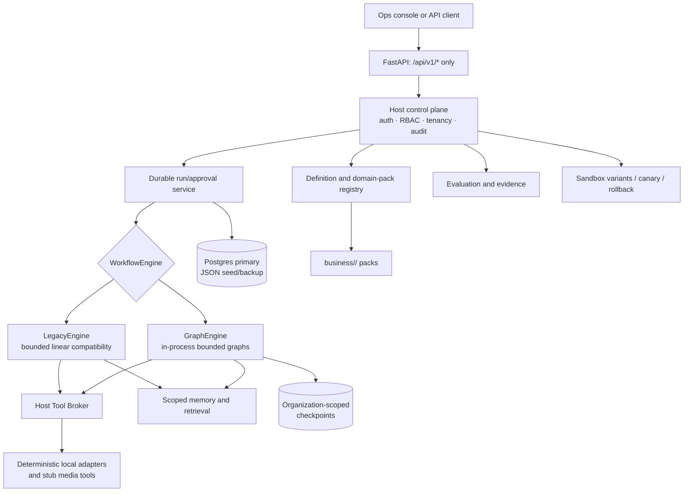

# Technical Design: Generic Swarm Business OS

## Overview

Generic Swarm Business OS is a governed, evidence-first multi-agent operating system implemented **only** in `C:\Project\common-agent-swarm-ops` (the Target Workspace). `structure.md` is the authoritative architecture and product-bar contract; `requirements.md` is the acceptance baseline. The reference workspace is not accessed by this design or implementation plan, and no material from it may be executed, modified, copied, or adopted without a recorded prior human approval.

The current target workspace contains CASOPS scaffolding and no `backend/`, `frontend/`, or `business/` runtime. Consequently, this is a reimplementation design, not a migration claim. Each phase earns its next capability through deterministic local evidence; a failed gate leaves the previous stable phase intact.

### Design decisions

| Decision | Rationale |
|---|---|
| FastAPI under `/api/v1/*` is the only public control plane | Satisfies the public-surface boundary and prevents a second orchestration API. |
| `WorkflowDNA` and permitted pack graph JSON are validated, portable IR | Keeps workflow definitions reviewable and domain packs isolated from host code. |
| In-process bounded `GraphEngine` plus compatible bounded `LegacyEngine` | Supports controlled migration without exposing a graph server or assuming the target works. |
| A deterministic host tool broker is the only tool invocation path | Makes authorization, audit, side-effect evidence, and fail-closed behavior enforceable outside model output. |
| Postgres is the durable primary store when configured; local JSON is a seed/backup only | Provides restart-safe runs and organization-scoped checkpoints without overstating local fallback as production durability. |
| Local deterministic adapters and stub media tools are the initial execution substrate | Produces reproducible product-bar evidence without SaaS credentials, network calls, or live media providers. |
| Variants are immutable sandbox records and production promotion is separately gated | Ensures evolution cannot silently modify a production workflow, graph, prompt, role, tool policy, or host code. |

A conflict in the structure contract’s historic “real host path” wording is resolved by Requirements 1 and the user’s explicit scope: all planned paths below are relative to the Target Workspace. This design neither reads nor relies upon the reference workspace.

### Research findings informing the design

The in-process graph choice is aligned with [LangGraph persistence guidance](https://docs.langchain.com/oss/python/langgraph/persistence), which supports recovery and continuation through persisted state, and [LangGraph interrupt guidance](https://docs.langchain.com/oss/python/langgraph/interrupts), which exposes JSON-serializable pause payloads for human decisions. These capabilities are wrapped by Host-owned run, authorization, and approval records; they do not create a public LangGraph surface. Content from these sources was rephrased for compliance with licensing restrictions.

## Architecture



The Host is domain-agnostic. Domain-specific agents, tools, rubrics, workflows, graphs, policies, and schemas remain in `business/<domain_id>/`; pack assets never add control-plane routes, direct tool calls, or an independent execution loop.

### Trust boundaries and invariants

1. All caller, model, retrieved, pack, workflow, and adapter input is untrusted until validated.
2. The Host derives organization, actor, and authorization context from authenticated request state; workflow payloads cannot supply or override them.
3. Only Host services write durable state or invoke adapters. Graph nodes and legacy steps receive narrow service interfaces.
4. Every critical action pauses before its effect; an approval is a reauthorization trigger, not a permission cache.
5. Failed evidence, unavailable audit, ambiguous state, missing scope, and missing authorization fail closed.
6. Production assets are immutable versions. Sandbox variants use separate IDs, checkpoint namespaces, and promotion records.

## Components and Interfaces

### Host FastAPI control plane

`backend/app/main.py` creates one FastAPI application and mounts only versioned routes beneath `backend/app/api/v1/router.py`. Internal graph compilation, checkpointers, adapters, repositories, and workers are Python services—not separately reachable HTTP APIs. Any non-`/api/v1/*` operator route is rejected; health and documentation are either versioned or disabled in production configuration.

| API family | Representative operation | Contract |
|---|---|---|
| Definitions | `POST /domains/register`, `GET /workflows/{id}/topology` | Validate data-only manifest/DNA/graph inputs before registry persistence; registration loads inactive draft/registered agents only. |
| Runs | `POST /workflows/{id}/run`, `POST /workflow-runs/dispatch`, `GET /workflow-runs/{id}` | Persist queued `RunRecord` with engine selection before dispatch. Dispatch is idempotent per queued attempt. |
| Observation | `GET /workflow-runs/{id}/graph-state`, `GET /workflow-runs/{id}/events` | Return an organization-filtered, redacted projection of steps, topology, evidence, effects, and interruption state. |
| Approvals | `POST /approvals/{id}/decision` | Retain every submitted decision; only valid approval resumes and reauthorizes. Valid denial remains paused. |
| Memory and PI | ingestion/retrieval endpoints under the same versioned router | Enforce tenant and scope resolution before storage or retrieval. |
| Evaluation/evolution | evaluate variant, canary decision, promotion request | Creation and evaluation may affect sandbox state only; promotion applies only the single fully-evidenced candidate. |
| Video release | artifact handoff, release request, release decision | Validate lineage and release gates without calling external media services. |

Responses for actions, recommendations, approvals, and failures include a run identifier and timestamp plus available evidence, confidence in `[0,1]`, uncertainty, correction control, or action preview. The request model contains an operation list; it validates **each** operation and returns a prohibited-operation error if any operation requests automatic promotion, Host-code rewrite, unbounded orchestration, or orchestration without recorded authorization. Failure to deliver this error blocks production changes.

### Definition and pack registry

`DomainPackValidator` consumes JSON from an allowlisted target-workspace path or an inline request payload. It canonicalizes identifiers, rejects path traversal and duplicate canonical IDs, and returns a validation report rather than partially activating assets. A manifest is valid only with one unique pack ID, 1–100 unique agents, statuses limited to `draft` or `registered`, and no production-activation request. A valid registration persists all agents in their supplied non-active status; an invalid registration persists an inactive pack outcome and denies activation for every member.

`AgentActivationService` evaluates learning requirements atomically. For an agent requiring learning, exactly one matching `AgentLearningContract` must name that agent, enable the reflect hook, and enumerate 1–10 approved memory scopes. Any defect rejects the complete activation transition and preserves its prior agent record. Draft agents cannot transition to production active.

`WorkflowDefinitionValidator` validates schema, version, owner, agent references, scoped memory reads/writes, tool IDs, risk gates, rollback declaration, engine selection, and bounded orchestration configuration before a run exists. `GraphDefinitionValidator` additionally validates allowed patterns (`pipeline`, `supervisor`, `router`, `critique`, `map_reduce`, `pack_spine`), topology reachability, bounded loops, and no direct adapter edge. Invalid definitions never dispatch.

### Workflow engines and lifecycle

```text
create run -> persist queued record -> dispatch
  -> select registered engine -> validate/compile -> execute bounded steps
  -> [critical action] create approval + checkpoint -> waiting_for_approval
  -> valid approval -> reauthorize -> resume from checkpoint
  -> terminal completed | failed | cancelled
```

```python
class WorkflowEngine(Protocol):
    def start(self, run: RunRecord, definition: WorkflowDefinition) -> EngineStartResult: ...
    def execute(self, run_id: RunId) -> EngineExecutionResult: ...
    def resume_from_approval(self, run_id: RunId, approval_id: ApprovalId) -> EngineExecutionResult: ...
    def cancel(self, run_id: RunId, reason: str) -> EngineExecutionResult: ...
```

The protocol is illustrative; task implementation selects exact language types. Both engines use the same lifecycle service, broker, memory service, repositories, status model, and audit writer.

* `LegacyEngine` is a bounded linear walker over validated DNA steps. It remains selectable until the migration evaluator records all required gates. When gates are satisfied, the registry atomically disables new and active LegacyEngine execution: active legacy runs are cancelled/failed with evidence rather than allowed to continue.
* `GraphEngine` compiles validated DNA and permitted graph IR in-process into host-owned state graphs. It maps graph state into the durable run projection. Per run it enforces at most 100 node visits, 12 handoffs, 900 seconds wall-clock, and 50 tool requests; exceeding any limit creates failure evidence, stops unstarted work, and prevents subsequent nodes.
* Each GraphEngine thread ID is `{organization_id}:{run_id}`. The checkpoint repository must verify the request organization equals the embedded and stored organization before resume. Cross-organization resume is denied before checkpoint lookup.
* State contains only serializable case data, append-only messages, route, artifact references, memory-hit references, risk/gate state, metrics, and `tool_effects`; secrets and unredacted sensitive source material are excluded.

Failure handling is a durable sub-state, not best effort. A failure/timeout/interrupt ambiguity immediately sets status `failed`, records available error and completed-effect evidence, prevents every unstarted step, and exposes the run. `failure_processing_complete` becomes true only after those evidence, effects, termination, and observability obligations are durably recorded. A normal terminal execution records `completed` and retains completed effects.

### Host tool broker and governance

`HostToolBroker.request_tool()` is the only interface given to agent nodes and linear steps. It resolves a registered local adapter only after computing:

```text
agent.allowed_tools ∩ step.declared_tools ∩ role/RBAC permissions ∩ organization scope ∩ risk policy ∩ approval state
```

Every factor must pass for an invocation. A denial is independently evaluated for each requested call, creates an audit event, and makes no adapter invocation or effect. If denied-call auditing is unavailable, the broker still denies. Adapters produce deterministic `ToolEffect` records (request digest, adapter version, outcome, timestamps, reversible/compensation metadata) and never accept arbitrary callable names, shell commands, credentials, or external URLs.

`GovernanceService` determines risk tier from the validated definition and case, identifies critical/irreversible operations, and invokes `ApprovalService.pause_before_effect()`. Approval requests include a redacted action preview, supporting evidence, intended effect, rollback/compensation preview, and correction link. Submitted decisions are immutable audit records. Reasons outside 1–1,000 characters are retained but marked invalid and leave the run paused. Values other than `approved` or `denied` are retained as invalid and keep the run paused. A valid denial remains paused. A valid approval causes a fresh full broker intersection check before the effect.

### Scoped, provenance-bearing memory and process intelligence

`MemoryService` separates workflow, organization, and approved agent scopes. `MemoryWrite` has an impact level, writer, source/provenance references, source-log set where relevant, and an allowlisted target scope. High-impact writes require nonempty provenance and a writable audit destination (primary audit or configured alternative); absence of either denies the write and records the denial where possible. If neither audit target is available, a durable safety latch blocks all high-impact writes through normal, critical, and recovery execution until an audit-health check clears it.

`KnowledgeRetriever.retrieve()` always performs scope-filtered Tier-0 semantic retrieval first, then permits Tier-1 entity-link/multi-hop retrieval only when the query needs relationships, and Tier-2 summary retrieval only for configured global synthesis. Each result carries provenance; no result returns no knowledge. It never broadens to another organization or agent scope after an in-scope miss.

`ProcessIntelligenceService.ingest()` validates permitted event-log entries and writes artifacts under `business/process-intelligence/` only through root-confined repository helpers. Each discovered-process, conformance, bottleneck, or causal-hypothesis artifact stores source log-set ID and supporting record references.

### Evaluation, evolution, and local adapters

`EvaluationService` runs deterministic golden JSON tasks plus named regression, adversarial, historical-replay, cost, latency, safety, and compliance checks. It retains a distinct result record for each run, including identical repeated task/configuration executions. A blocking failure atomically prevents the next configured transition—even one already preparing to proceed—while non-blocking checks continue. A later run with all blocking checks passing permits the next configured transition independently of historic failures. `ProductBarEvidenceService` records independent E1–E9 pass/fail evidence, with E1 absence marking the bar incomplete.

`EvolutionService.propose()` writes an immutable `SandboxVariant` only; it cannot mutate production DNA, graph topology, prompts, roles, tool configuration, or Host code. Promotion considers exactly one candidate and requires target-metric improvement in its stated direction, no-worse safety/compliance, named regression and adversarial passes, rollback plan, approved scoped canary, audit completeness, evidence retention, and human approval. Missing/failed conditions retain failure evidence and block promotion. Evidence-retention failure also blocks promotion but does not stop non-promotion operations. Canary approval is retained until activation; an active canary confines execution to the approved scope. A failed canary stops the variant, performs the recorded rollback, and retains evidence.

Adapters are deterministic local implementations for contract parsing, policy retrieval, CRM, billing, email, audit, and video stubs. They are invoked through the broker, never use network resources, and expose fixed versioned behavior for evaluation fixtures. This is intentional product behavior, not a mock of an unverified reference system.

### Video pack controls

The video pack is a constrained domain pack, not a privileged subsystem. Its registry validation adds an exact 114-agent inventory and one inventory entry per agent. The initial spine is a `pack_spine` or `supervisor` graph over `video.*` agents and deterministic stub media tools with zero external resource access.

`VideoArtifactService` uses copy-on-write artifact versions. `LineageValidator` rejects cyclic, ambiguous, missing, or unknown parents. `ReleaseService` releases only when lineage is an acyclic DAG, named rights/consent, provenance/sign-off, quality and release checks pass, and no blocker remains unresolved. Otherwise it denies release, preserves the request, and returns every unmet condition. A detected video blocker—including a ComplianceAgent blocker—publishes a durable blocker event; the engine cancellation token prevents scheduling a new graph step in under five seconds while the graph-state projection stays visible. Critique handling bounds `major` findings to three refine/review attempts before escalation; blockers never silently advance.

## Data Models

All durable records include immutable `id`, `organization_id` where tenant-scoped, `created_at`, `updated_at`, schema version, and correlation/request ID. Repositories use optimistic concurrency/version checks for transitions, append-only audit/evidence records, and redacted projections for API responses.

| Model | Key fields | Invariants |
|---|---|---|
| `DomainPack` | `pack_id`, `manifest_hash`, `status`, `agents[]`, validation report | `pack_id` unique; 1–100 unique agent IDs; invalid manifests are inactive; registration never activates production. |
| `AgentSpec` / `AgentLearningContract` | agent ID, lifecycle status, allowed tools, `requires_learning`; matching ID, reflect enabled, approved scopes | Draft cannot activate; required learning is all-or-nothing with exactly matching contract and 1–10 scopes. |
| `WorkflowDefinition` | immutable ID/version/hash, engine, pattern, steps/nodes/edges, declared tools and memory scopes, guardrails, rollback | Validated before compile; only bounded patterns/configuration; tool/memory references are registered and scoped. |
| `RunRecord` | run ID, definition version/hash, engine, graph ID/thread ID, status, step projection, failure state, output, `tool_effects[]` | Unique run ID; queued+engine persisted before dispatch; completed effects retained; failed runs cannot be marked fully processed early. |
| `ExecutionBudget` / `ExecutionMetrics` | node visits, handoffs, elapsed time, tool requests; limits and event timeline | Graph limits are 100/12/900 seconds/50; append-only counters; limit breach terminates unscheduled work. |
| `CheckpointRef` | organization ID, run ID, thread ID, namespace, sequence, snapshot reference | Thread is `{org}:{run}`; only same-org resume; sandbox namespace cannot resume production run. |
| `ToolRequest` / `ToolEffect` | agent, step, adapter ID, normalized input digest, authorization decision; outcome/effect digest/compensation | Invocation requires full authorization intersection; denial has no effect; effect is durable before next dependent step. |
| `AuditEvent` | actor, operation, decision, reason, evidence references, timestamp, alternate sink marker | Denials and high-impact writes require audit; audit-unavailable high-impact state activates durable block latch. |
| `ApprovalGate` / `ApprovalDecision` | run, step/action preview, risk, state; submitted value/reason/validity | Gate before critical effect; submissions immutable; only valid `approved` allows reauthorization; valid `denied` stays paused. |
| `ScopedMemory` / `ProvenanceRef` | scope type/id, memory type, impact, writer, content ref, sources, retrieval index | Scope filters precede retrieval; high-impact writes require provenance and audit; all retrieval results include provenance. |
| `ProcessArtifact` | kind, source log-set ID, supporting event refs, output ref | Each artifact is traceable to permitted source events. |
| `EvaluationRun` / `EvidenceItem` | suite/config hashes, task/check results, blocking status; product-bar criterion, result, evidence refs | Each evaluation execution is retained; identical inputs still create distinct run IDs; transition gates use current result. |
| `SandboxVariant` / `PromotionAssessment` | production baseline ref, variant config hash, lifecycle; metric comparison, check refs, rollback/canary/approval refs | Sandbox-only until exactly one complete candidate satisfies all promotion conditions. |
| `Canary` | variant, approved scope, active state, criteria, rollback ref, evidence | Only one active approved scope per canary; failure stops it and invokes recorded rollback. |
| `VideoArtifactVersion` / `ReleaseRequest` | immutable artifact ID/version, parent IDs, rights/consent, QC, provenance/sign-off; unmet conditions and decision | Parents are a known acyclic DAG; release requires all named gates and no blockers. |
| `Blocker` / `CritiqueMessage` | source agent, severity/category, evidence, resolution, deadline, graph state ref | Compliance blocker interrupts; unresolved blocker blocks release and next graph step; major count is bounded. |

Persistence starts with explicit repository interfaces (`RunRepository`, `ApprovalRepository`, `AuditRepository`, `CheckpointRepository`, `PackRepository`, `MemoryRepository`, `EvaluationRepository`, `ArtifactRepository`). A Postgres implementation is required for configured durable operation; a JSON implementation is restricted to seeded/local demonstration state and cannot claim E2/E8 durability. Database schema migrations, transaction boundaries, and backup/restore exercises are evidence artifacts, not implicit operational promises.

## Correctness Properties

*A property is a characteristic or behavior that should hold true across all valid executions of a system—essentially, a formal statement about what the system should do. Properties bridge human-readable specifications and machine-verifiable correctness guarantees.*

### Consolidation review

The prework identified common state-machine and policy invariants that would otherwise repeat. The workspace authorization property subsumes individual prohibited source-operation variants; manifest validity and registration are combined because registration must consume the validator result atomically; high-impact memory combines provenance, scope, audit fallback, and latch behavior; broker authorization combines all allow/deny and independent-call clauses; approval combines submission retention and resume-time reauthorization; promotion combines candidate cardinality and evidence conjunction. These consolidated properties still map to every property-classified acceptance criterion below. Integration, smoke, example, and edge-case criteria remain in the Testing Strategy instead of being incorrectly expressed as universal properties.

### Property 1: Architecture decisions declare their authority

For all valid architecture decisions created by the Host, the rendered decision identifies `C:\Project\common-agent-swarm-ops` as Target_Workspace and `structure.md` within that workspace as Structure_Contract.

**Validates: Requirements 1.1**

### Property 2: Workspace and adoption authorization is fail-closed

For any requested access, write, execution, or adoption operation, the Host permits it only when the resolved path is inside Target_Workspace and, for reference-derived adoption, a recorded prior human approval exists; every other prohibited request is refused without changing either workspace.

**Validates: Requirements 1.2, 1.3, 1.4, 1.5**

### Property 3: Domain manifest validation and registration are atomic

For any manifest, registration accepts and loads all agents as non-active only when it has one unique pack ID and 1–100 uniquely identified draft/registered agents with no production-activation request; otherwise the pack is inactive and every member’s production activation is denied.

**Validates: Requirements 2.2, 2.3, 2.4**

### Property 4: Lifecycle and learning activation preserve safety

For any agent activation request, a draft agent never becomes production active; an agent requiring learning activates only with an exactly matched, reflect-enabled learning contract containing 1–10 approved scopes, and every other learning-contract outcome leaves the agent state unchanged.

**Validates: Requirements 2.5, 2.6, 2.7**

### Property 5: Process artifacts retain source traceability

For all permitted event log sets and derived process-intelligence artifacts, each artifact contains the originating log-set identifier and references to the supporting records used to derive it.

**Validates: Requirements 3.1**

### Property 6: High-impact memory is provenance-, scope-, and audit-safe

For any high-impact memory write, storage succeeds only when writer, provenance, approved scope, and an auditable sink are present; retrieval is limited to that scope, provenance-free writes are denied with an audit event when possible, and while both audit sinks are unavailable every high-impact write remains blocked until audit health is restored.

**Validates: Requirements 3.2, 3.3, 3.5**

### Property 7: Retrieval is semantic-first and cannot disclose across scope

For any requester, query, and scoped corpus, retrieval evaluates permitted semantic retrieval before any later tier, returns provenance for every permitted result, and returns no knowledge rather than a foreign-scope result when all permitted in-scope tiers miss.

**Validates: Requirements 3.6, 3.7**

### Property 8: Definition validation controls run creation and dispatch ordering

For all workflow definitions, only valid DNA or permitted graphs create a uniquely identified RunRecord whose selected engine and queued status are durably persisted before dispatch; invalid definitions create neither execution nor tool effect.

**Validates: Requirements 4.1, 4.2, 6.1**

### Property 9: Failure processing is terminally safe and evidence-complete

For any partially executed run that fails, times out, is interrupted ambiguously, or otherwise enters failure handling, the run is failed, all available failure and completed-effect evidence is retained, every unstarted step is stopped, and `failure_processing_complete` is false until all required processing obligations are complete.

**Validates: Requirements 4.3, 4.4**

### Property 10: Graph budget enforcement stops at the first breached limit

For any GraphEngine event sequence, the engine schedules no further work after the first count exceeding 100 node visits, 12 handoffs, 900 seconds wall-clock time, or 50 tool requests, and records the budget failure in the RunRecord.

**Validates: Requirements 4.5**

### Property 11: Migration gate satisfaction is an all-evidence conjunction

For any migration evidence set, the dual-engine migration gate is satisfied if and only if both engines, multi-specialist handoffs, operator-visible graph and interrupt, stubbed gated video spine, cross-organization-resume denial, and fail-closed tool allow-list proofs all pass.

**Validates: Requirements 4.8**

### Property 12: Successful execution preserves effects at completion

For any successful workflow execution that has neither failure nor interruption, terminalization sets status to `completed` and preserves the complete set of completed tool effects.

**Validates: Requirements 4.9**

### Property 13: Tool authorization is complete, independent, and fail-closed

For any sequence of distinct tool requests, each request evaluates every authorization-intersection constraint before invocation, invokes exactly when all constraints pass, and otherwise creates no invocation or effect while recording a denial when an audit sink is available; the prior request’s result cannot authorize the next request.

**Validates: Requirements 5.1, 5.2, 5.3, 5.5**

### Property 14: Approval gates retain submissions and reauthorize effects

For any critical action and submitted approval decision, the run pauses before the effect and retains the submitted reason/value; invalid reasons or values remain paused, valid denials remain paused, and a valid approval produces an effect only when a new full authorization intersection passes at resume time.

**Validates: Requirements 5.6, 5.7, 5.9, 5.10, 5.11**

### Property 15: Operator-visible executable state is actionable before effect

For any displayed recommendation, action, approval gate, or failure, the projection contains at least one required human-centered field, and every executable action’s preview is emitted before its tool invocation.

**Validates: Requirements 6.5, 6.6**

### Property 16: Evolution variants are isolated and promotion is exhaustive

For any production configuration and proposed variant, proposal leaves production byte-for-byte unchanged; promotion is permitted only for exactly one candidate when target metrics strictly improve in their configured direction and every safety, compliance, named evaluation, rollback, canary, audit, evidence-retention, and human-approval condition passes—otherwise promotion is blocked with retained missing/failing evidence.

**Validates: Requirements 7.1, 7.2, 7.3, 7.6**

### Property 17: Active canaries enforce approved scope containment

For any active approved canary and attempted variant operation, the operation is permitted only if its organization/workflow/case scope is contained by the approved canary scope.

**Validates: Requirements 7.9**

### Property 18: Evaluation results preserve execution identity and current-blocker semantics

For all evaluation task/check matrices and repeated task/configuration executions, the Host retains one result per evaluated cell and a distinct result record for each execution; the next transition is permitted if and only if every current blocking check passes, regardless of previous blocking failures.

**Validates: Requirements 8.2, 8.5, 8.8**

### Property 19: Product-bar evidence is independently complete

For any Product_Bar assessment, its result contains an independent evidence entry for each named E1–E9 capability, and the assessment is incomplete whenever E1 lacks a pass result.

**Validates: Requirements 8.6**

### Property 20: Video inventory is an exact agent-to-entry bijection

For any Video_Pack inventory, validation succeeds if and only if it has exactly 114 distinct Video_Pack agents and exactly one corresponding inventory entry for each.

**Validates: Requirements 9.1**

### Property 21: Video release is a complete fail-closed gate

For any video artifact version and release request, release occurs if and only if the known immutable parent lineage is acyclic, every named release/quality/rights/consent/provenance/sign-off requirement passes, and no blocker remains; all other cases deny release, retain the request, and report every unmet condition.

**Validates: Requirements 9.4, 9.5**

### Property 22: Multi-operation production guard is atomic yet isolates safe operations

For any request operation list, the Host classifies each operation independently; any automatic promotion, Host-code rewrite, unbounded orchestration, or unrecorded-authorization orchestration returns a prohibited-operation error and leaves production unchanged, while an authorized safe production operation may commit despite an error from another safe non-prohibited operation.

**Validates: Requirements 10.3, 10.4, 10.6**

## Error Handling

| Condition | Host behavior | Durable evidence / recovery |
|---|---|---|
| Authentication, tenancy, RBAC, or scope mismatch | Return a typed forbidden/not-found response without revealing cross-tenant existence. | Audit denied operation; do not query or resume foreign checkpoint. |
| Invalid manifest, ALC, DNA, graph, event, artifact, or request payload | Return a validation error with field-level safe diagnostics; do not compile, dispatch, activate, ingest, or release. | Persist validation report where acceptance requires inactive/rejected state; retain request correlation ID. |
| Prohibited request operation | Return `prohibited_operation`; abort production transaction. | If error delivery fails, preserve production block latch and no mutation. |
| Broker authorization denial | Deny before adapter call regardless of audit availability. | Record denial if possible; audit failure never converts a deny into allow. |
| Audit outage | Use configured alternate sink only where accepted; otherwise reject high-impact writes and retain durable audit-unavailable latch. | Read-only/reversible operations continue only under their independent policies; recovery requires a successful audit-health check. |
| Adapter failure, timeout, ambiguity, or budget breach | Prevent dependent/unstarted steps, transition run to failed, and expose state. | Retain completed `ToolEffect`s and failure evidence; execute only predeclared compensation, never speculative rollback. |
| Approval input error | Retain raw decision and validation state; keep run paused. | A human submits a new valid decision; no silent normalization to approval/denial. |
| Checkpoint/database outage | Do not claim durable dispatch/resume; fail closed for transitions requiring persistence. | Health reports dependency state; operators may inspect immutable in-memory diagnostic events but cannot resume without valid durable checkpoint. |
| Evaluation/promotion evidence failure | Block next guarded transition or production promotion as applicable. | Retain result/failure evidence; continue only explicitly non-blocking evaluation or non-promotion work. |
| Video blocker or release failure | Stop scheduling new graph steps, deny release, and display blocker/unmet checks. | Preserve graph-state snapshot, release request, lineage, and resolution/rollback evidence. |

Errors use stable machine-readable codes (for example `validation_failed`, `authorization_denied`, `approval_pending`, `audit_unavailable`, `checkpoint_scope_denied`, `evaluation_blocked`, `release_denied`, and `prohibited_operation`) plus a request ID. API errors never return secrets, raw authorization policies, foreign identifiers, or unredacted memory. The operator console maps these codes to correction controls and displays uncertainty rather than inventing success.

## Testing Strategy

### Test layers and acceptance coverage

Property-based testing is appropriate for the pure validators, authorization rules, scope filters, state transitions, counters, lifecycle policies, and evidence matrices described above. The Python backend will use **Hypothesis** rather than a custom generator. Each of the 22 properties is implemented by one property test with at least 100 examples and a source comment in this form:

```text
Feature: generic-swarm-business-os, Property N: <property title>
```

Generators must create bounded valid/invalid IDs, scopes, manifests, definitions, state-machine sequences, DAGs, and operation lists; they must not create network, filesystem-outside-target, or live-provider effects. Shrunk counterexamples, definition/configuration hashes, seed, and correlation ID are retained as evaluation evidence.

| Test class | Acceptance criteria covered | Approach |
|---|---|---|
| Property tests | 1.1–1.5; 2.2–2.7; 3.1–3.3, 3.5–3.7; 4.1–4.5, 4.8–4.9; 5.1–5.3, 5.5–5.7, 5.9–5.11; 6.1, 6.5–6.6; 7.1–7.3, 7.6, 7.9; 8.2, 8.5–8.6, 8.8; 9.1, 9.4–9.5; 10.3–10.4, 10.6 | Implement Properties 1–22 with repositories/adapters replaced by deterministic fakes where I/O would obscure business logic. |
| Unit/edge examples | 2.1; 3.4; 4.6–4.7; 5.4, 5.8; 6.2–6.3; 7.4–7.5, 7.7–7.8; 8.7; 10.5 | Explicit assertions for host domain neutrality, audit fallback, active-legacy retirement, denied-audit failure, reason length boundaries 0/1/1000/1001, dispatch persistence ordering, no/multiple candidates, E1 absence, and response-delivery failure. |
| Integration tests | 6.4; 7.10; 8.3–8.4; 9.2–9.3; 10.2 | Isolated Postgres fixture for restart/same-org checkpoint behavior; barrier-controlled evaluation and scheduler fakes; network-denied local adapters and video stubs; mock rollback adapter. These tests never use the reference workspace or live SaaS/media providers. |
| Smoke/configuration checks | 8.1; 10.1 | Assert ≥20 JSON golden fixtures and named suite registration; inspect the FastAPI route table and same-process engine registration. |
| Contract and schema tests | Requirements 2, 4, 6, 9 | JSON Schema positive/negative fixtures, API/OpenAPI route checks, WorkflowDNA/graph validation, artifact handoff backward-compatibility, and lineage DAG checks. |
| End-to-end evidence tests | E1–E9 and Requirements 4–10 | Run E1 against each selected engine, plus graph topology/interrupt, cross-org resume denial, video spine/release gates, and deterministic eval/canary rollback paths. E1 does not establish full product-bar completion until its independent E1 evidence record passes. |

The test hierarchy deliberately separates pure logic from durability and scheduling tests. In-memory checkpoints are permitted for unit/property tests; restart claims require the isolated Postgres integration test. Timing assertions for video blockers use a monotonic clock and a deterministic scheduler; tests assert the less-than-five-second stopping criterion without relying on an external load environment.

### Evidence-first rollout and rollback strategy

This sequence is an implementation order and gate model, **not** an implementation task list.

1. **Foundation evidence:** establish target-root confinement, data schemas, repositories, audit event model, deterministic fixtures, and a baseline manifest of the empty/new target runtime. Gate on schema, policy, and target-boundary tests; rollback is removal of an unactivated versioned component, never source copying.
2. **Controlled linear path:** deliver FastAPI-only auth/tenancy, definition validation, RunRecord persistence, LegacyEngine, broker, local adapters, approvals, and the legacy E1 path. Gate on durable queued-before-dispatch, no-effect denial, approval reauthorization, and E1 evidence. Rollback selects the previously versioned workflow definition and runs declared compensation for recorded effects.
3. **Knowledge and quality path:** add scoped memory, process-intelligence artifacts, the local evaluation corpus, product-bar evidence, and sandbox-only evolution. Gate on provenance/audit latches, scope isolation, ≥20 tasks, all suite outcomes, and no-auto-promotion. Rollback disables the sandbox variant/canary without altering production.
4. **Video constrained spine:** add the exact inventory, stub-only pack spine, handoff/version validators, blocker bridge, and release policy. Gate on 114-entry bijection, blocked invalid lineage/rights/QC/provenance/ComplianceAgent cases, and a deterministic spine with no network. Rollback stops the canary or releases no artifact; immutable artifacts are never overwritten.
5. **Dual-engine graph migration:** add the engine seam, bounded GraphEngine, Postgres checkpoint bridge, topology/state projections, and graph interrupt approvals while LegacyEngine remains available. Gate on dual E1, two-specialist supervisor handoffs, visible graph/interrupt, stubbed video spine/release gate, cross-org resume denial, and broker allow-list proof. Before every default flip, retain the LegacyEngine rollback option.
6. **Legacy retirement:** disable LegacyEngine only after all migration gates are current and independently retained. This action cancels/marks active legacy execution with evidence as required, rather than allowing a hidden split-brain runtime. Rollback of retirement is a new reviewed release restoring the versioned compatibility engine; it is never automatic.

Every gate emits immutable evidence with definition/configuration hashes, adapter and schema versions, run/evaluation IDs, timestamps, test command/result, metrics, and links to supporting artifacts. A gate failure blocks the next transition and preserves the prior approved configuration. Production recovery uses predeclared compensation or rollback plans only; it does not rerun ambiguous effects, widen authorization, disable audit, or bypass approval.

### Design validation

This document is validated as a spec artifact using the target workspace’s SDD/document diagnostics. No implementation tests are run because this phase creates design only and the target currently has no application runtime. The first implementation phase must record its focused test commands and results as evidence, beginning with the existing `npm run sdd:check` gate and then the newly introduced backend/business checks.
