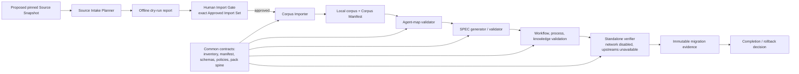

# Technical Design: Migration Redesign

## Overview

The Migration Management System makes `business/video/` the self-contained, pinned authority for the Video Pack. It imports approved video-domain material as inert local reference data, reconciles it to the existing Common Repository’s 114 Common Agent IDs, validates adapted local operational assets, and records evidence sufficient to prove the pack offline. The system preserves common-owned contracts, the non-active `L0` runtime posture, local deterministic model policy, network restrictions, critique/refinement controls, and human release gates. It does not activate providers, credentials, network access, production agents, or an alternate runtime/control plane.

This design implements only the approved behavior in [requirements.md](requirements.md). It treats `generic-swarm-ops` and `va-agent-swarm` as historical provenance and future reviewed-update inputs, never as required runtime or design dependencies. The existing Python LegacyEngine retirement feature under `backend/app/engines/migration.py` is out of scope: it may inform append-only evidence conventions, but it neither imports nor validates the Video Pack.

**Design decisions.**

1. **Local authority is data-first.** The checked-in pack, its common contracts, local corpus, mapping, specifications, and workflows are the source of truth. A required reference must resolve under the Common Repository root; upstream values are provenance-only metadata.
2. **Approval precedes mutation.** Source discovery and dry-run reporting are side-effect free. Write mode admits only an exact, recorded Approved Import Set approved by a Human Import Gate.
3. **Validation is fail-closed at safety boundaries.** Path escape, prohibited material, secret findings, collisions, incomplete/reviewless mappings, non-local required references, integrity mismatches, unsafe workflows, and offline-precondition failures prevent the affected write or release action.
4. **Imported content is never configuration.** Corpus material remains untrusted inert reference content and is excluded from configuration, tool, provider, credential, network, and runtime activation contexts.
5. **Completion is an evidence-backed release decision.** Phase results may record unresolved blockers, but any unresolved completion gate blocks Migration Completion. Rollback is a human-authorized Git revert of the recorded migration change set.

## Architecture



The system has two authority planes. **Common Pack Contracts**—the current local manifest, 114-entry inventory, schemas, policies, agent configurations, and `workflows/pack_spine.json`—remain authoritative and are never silently overwritten by imported content. **Video Pack content** beneath `business/video/` becomes authoritative for the pinned version after every required release gate passes. Source repository URL, commit, path, and license are retained only in provenance fields. A stricter common safety rule always wins over imported advice.

The migration pipeline operates on local files only after a Source Snapshot is selected. It has no provider, credential, or network capability. Every validator emits a deterministic machine-readable report, returning non-zero on its failure conditions. Diagnostic documentation checks are deliberately isolated: a Documentation-Integrity Failure does not stop unrelated import or validation work, but it does prevent a completion claim.

## Target Filesystem Contract

```text
business/video/
  README.md                         # local entry points, ownership, refresh policy
  manifest.json                     # existing common contract; 114-agent registration
  inventory.json                    # authoritative common IDs and non-active posture
  ROSTER.json                       # local roster using Common Agent IDs only
  AGENT_SOURCE_MAP.json             # reviewed mapping for exactly 114 common IDs
  MAP.md                            # human-readable local mapping
  PROCESSES.md
  process_coverage.json
  agents/<common-agent-id>/
    agent_spec.json                 # preserved common runtime contract
    SPEC.md                         # substantive local specification
  corpus/
    MANIFEST.json                   # canonical imported-file paths, sizes, digests, provenance
    README.md
    SOURCE_COMMIT.txt
    SOURCE_URL.txt
    SOURCE_COPIED_AT.txt
    <approved reference files>
  workflows/
    pack_spine.json                 # retained safe baseline until an adapted workflow passes
    <adapted-workflow>.dna.json
  knowledge/seeds/
  special_skills/<id>/              # present only after individual review
  policies/                         # existing authoritative common safety rules
  schemas/                          # existing authoritative common extension schemas
```

All source, destination, and required-reference paths are normalized relative paths. They must not be absolute, contain `..`, or resolve through a link outside their designated root. The importer never deletes files; an undeclared collision is a pre-write failure. Canonical lexicographic ordering and UTF-8 JSON serialization make manifests and reports reproducible.

## Components and Interfaces

| Component | Inputs | Responsibilities and output | Mutation boundary |
| --- | --- | --- | --- |
| Source Intake Planner | source root, declared snapshot revision, requested allow-list | recursively classify candidate paths; compute size/SHA-256; identify exclusions, path/link escape, prohibited material, secrets, provenance/license gaps, and destination collisions; produce `ImportDryRunReport` | None; must run with network disabled |
| Approval Verifier | dry-run report, Human Import Gate, Approved Import Set | prove the approval names the exact source revision and canonical proposed files/digests/destinations | None; mismatch blocks write mode |
| Corpus Importer | verified Approved Import Set, destination root | copy only approved files, create canonical manifest/provenance records, then re-hash destination files; report idempotent no-change result on reapplication | Writes only `business/video/corpus/` and its manifest/provenance files |
| Corpus Integrity Validator | Corpus Manifest and corpus files | recompute path, byte size, and SHA-256 for every entry; reject missing, extra declared, or mismatched content | None |
| Agent Source Map Validator | inventory, `AGENT_SOURCE_MAP.json` | require exactly the inventory’s 114 unique Common Agent IDs, allowed mapping status, reviewed rationale, reviewer, and timestamp; detect ambiguous or duplicate mappings | None |
| SPEC Builder and Validator | common `agent_spec.json`, approved map, local corpus references | draft only from local content; validate all required sections, concrete video responsibility, local sources, provenance, and required human reviews for critical roles | Write mode is blocked by any invalid mapping or failed precondition |
| Operational Asset Validator | workflows, process coverage, knowledge seeds, proposed special skills, Common Pack Contracts | validate common agent IDs, finite budgets, allowed tools, risk gates, compensation, critique loops, human interrupts, local consumers, and completed reviews | Does not register unsafe assets |
| Standalone Verifier | local pack root and explicit environment preconditions | require network disabled and both upstream repositories unavailable before any validation; run all integrity, identity, local-link, SPEC, workflow, process, and registration-path checks | None |
| Evidence and Completion Recorder | phase results, command results, digests, reviews, blockers, change-set reference | append immutable phase evidence, determine completion/block state, retain pre-import manifest digest and rollback reference | Writes only migration-evidence records |
| Documentation Integrity Checker | README, `adoption.md`, `structure.md`, local filesystem | compare ownership and asserted asset counts/paths to checked-in content | Returns diagnostics only; completion gate consumes its result |

Planned command-line seams are `scripts/business/import_video_corpus.py`, `scripts/business/build_video_agent_specs.py`, and `scripts/business/check_video_domain_standalone.py`. Each accepts `--dry-run` or `--write` when applicable, produces one canonical JSON result to stdout or a requested report path, writes no content during dry-run, and exposes stable diagnostic codes. The standalone checker is read-only and prints exactly `STANDALONE PASS` on complete success.


## Data Models

All records use JSON objects with explicit schema versions, normalized forward-slash relative paths, and canonical object-key/array ordering before digesting. Digest values use lowercase SHA-256 hexadecimal strings. Timestamps are ISO-8601 UTC. Reviewer identity is an approved local identifier; no secrets, credentials, or source-body content are copied into evidence records.

| Record | Required fields | Invariants |
| --- | --- | --- |
| `SourceSnapshot` | `source_repository`, `source_commit`, `source_root`, `recorded_at` | Records the proposed immutable revision before any pack mutation; provenance-only and never a required local reference. |
| `ApprovedImportSet` | `snapshot`, `files[]`, `total_bytes`, `license_status`, `approved_by`, `approved_at`, `approval_id` | Each file has source-relative path, destination-relative path, byte size, SHA-256, original path, provenance/license status; canonical file list is the exact Human Import Gate subject. |
| `ImportDryRunReport` | `snapshot`, `mode`, `included[]`, `excluded[]`, `findings[]`, `total_bytes`, `result` | Contains every included/excluded candidate and collision, unsafe-path, secret, and license/provenance finding; `mode=dry_run` records no mutations. |
| `CorpusManifestEntry` | `path`, `size_bytes`, `sha256`, `original_repository`, `original_commit`, `original_path`, `license_status` | `path` is unique and resolves beneath `business/video/corpus/`; actual file path/size/digest must match exactly. |
| `AgentSourceMapEntry` | `common_agent_id`, `mapping_status`, `source_agent_ids`, `source_documents`, `rationale`, `reviewed_by`, `reviewed_at` | One entry per common ID; `mapping_status` is `exact`, `composite`, `related`, or `common_only`; `common_only` has an empty source-agent list; any reuse of a source ID has distinct rationale per entry. |
| `AgentSpecificationReview` | `common_agent_id`, `reviewer`, `reviewed_at`, `scope`, `result` | Required before accepting specifications for orchestrator, compliance, rights/consent, privacy, legal, safety, provenance, release, judge, or human-review coordination roles. |
| `AdaptedWorkflowAssessment` | `workflow_path`, `workflow_digest`, `common_contract_digest`, `result`, `findings` | Passing output establishes common-ID references plus finite budget, allowed tools, risk gates, compensation, critique behavior, and human interrupt validity. |
| `KnowledgeSeedRecord` | `seed_path`, `provenance`, `consumer_ref`, `review_status` | The consumer is local and valid; seed instructions remain data and cannot enter a configuration context. |
| `SpecialSkillReview` | `skill_id`, `compatibility`, `security`, `overlap`, `license`, `consumer_ref`, `reviewer`, `reviewed_at`, `result` | A special skill remains absent unless every review dimension passes and a local consumer exists. |
| `MigrationEvidence` | `evidence_id`, `phase`, `result`, `commands`, `results`, `source_snapshot`, `correlation_id`, `recorded_at`, `blockers`, `residual_risks`, `change_set_ref` | Append-only; completion evidence also includes pre-import Video Pack manifest digest, corpus manifest digest, mapping review reference, standalone result, and documentation check result. |

The agent-map file has one top-level `entries` array and a declared `inventory_digest`. `ROSTER.json` contains the same ordered Common Agent IDs as the inventory. `MAP.md` is a human-readable projection of the reviewed map; it cannot substitute for the machine-readable record. Each `SPEC.md` has exactly one owning common-agent directory and the following required headings:

```markdown
# <Common Agent ID or human-readable role>

## Identity
## Responsibility
## Boundaries and escalation
## Inputs and outputs
## Quality and critique
## Runtime binding
## Local knowledge sources
## Provenance
```

A responsibility is substantive only when it describes a concrete video-domain outcome, artifacts, or acceptance conditions. A generic title or generic role string without video-domain behavior fails validation. Runtime binding summarizes the existing local `agent_spec.json` and must not alter status, model policy, network restriction, allowed tools, critique edges, or refinement limit. Local knowledge source links are Required Local References. Provenance links may describe upstream URLs, paths, and commits but must be labeled historical and cannot be the sole source needed to understand or validate the role.

## Core Processing Flows

### 1. Reviewed corpus intake

1. An operator records a `SourceSnapshot` with a pinned repository revision and source root before modifying the Video Pack.
2. The Source Intake Planner runs in dry-run mode with network access disabled. It walks the supplied local source tree, normalizes each candidate path, resolves links without allowing escapes, detects prohibited material and secret patterns, computes source metadata, maps every approved candidate to a destination path, and detects collisions.
3. The planner produces a deterministic `ImportDryRunReport`. Any unsafe path/link, prohibited source material, secret finding, undeclared collision, or incomplete license/provenance finding makes its result non-passing and returns non-zero. No destination is created or changed.
4. A human reviewer records a Human Import Gate that identifies the canonical Approved Import Set: source revision, each file’s digest and destination, byte total, and license/provenance findings.
5. Write mode first recomputes the dry-run canonical set and proves exact equality with the approved set. It refuses any scope expansion, digest drift, approval mismatch, or unapproved destination.
6. The Corpus Importer copies only the approved files into `business/video/corpus/`, writes the canonical `MANIFEST.json` and source metadata, and re-hashes every written destination. A failure before success leaves the pre-import pack state intact by staging output and only replacing newly created/import-owned outputs after all pre-write validation has passed. It never deletes an existing pack file.
7. Reapplying the same verified set compares destination file/manifest digests and emits an idempotent success with no content modification.

This flow protects Requirements 3 and 4. It treats source instructions and configuration-like text as corpus bytes only; the importer does not execute, parse for activation, or copy such content into common configurations.

### 2. Taxonomy mapping and local specifications

1. The Agent Source Map Validator reads the authoritative local inventory, not upstream directory counts, and constructs the required ordered set of 114 Common Agent IDs.
2. It validates map cardinality, exact set equality, one entry per Common Agent ID, allowed status, source-document locality, nonempty rationale, reviewer, timestamp, and `common_only` empty-source semantics. Ambiguous mappings are failures rather than guessed substitutions.
3. The SPEC Builder reads only the common agent configuration, reviewed map, and local corpus/local pack assets. In draft mode it produces a proposed result; in write mode it refuses to write any `SPEC.md` if the complete map has missing, duplicate, ambiguous, or unreviewed entries.
4. The SPEC Validator checks every agent directory, validates one substantive specification per inventory ID, accumulates all specification failures rather than stopping at the first, and verifies local source links and required critical-role review records.
5. The roster and human-readable mapping are generated or checked from the reviewed local map and retain Common Agent IDs only. Source IDs are provenance/relationship fields, never authoritative identities.

### 3. Operational assets and registration

A proposed upstream workflow is first translated into a pack-local workflow. The Operational Asset Validator accepts it only when all agent references exist in the authoritative inventory; its graph has finite node/handoff/time/tool budgets; all tools are allow-listed; it identifies risk gates, compensation behavior, critique loops, and human interrupts; and it does not request activation-changing configuration. `pack_spine.json` remains the safe baseline until such a workflow passes.

Process coverage can reference only passing local workflows and known Common Agent IDs. Each knowledge seed must retain local provenance and a local consumer. Each special-skill integration requires a completed compatibility, security, overlap, and license review plus a local consumer; otherwise it remains absent. Registration and dry-run registration use existing Common Pack Contracts and existing safe workflow paths only.

### 4. Standalone verification and release decision

1. The caller explicitly requests standalone verification with network disabled and both configured upstream repositories unavailable.
2. Before any content validator runs, the Standalone Verifier checks those preconditions. If either condition is false, it emits a deterministic machine-readable failure and exits non-zero without executing a validation step.
3. It validates corpus integrity; the 114-ID agreement across inventory, manifest, agent directories, map, roster, and specifications; every Required Local Reference; required and substantive SPEC content; workflow contracts; process coverage; and absence of upstream-required source paths.
4. On any failure it emits a stable, sorted machine-readable summary and exits non-zero. On complete success it emits `STANDALONE PASS` and a corresponding passing JSON result.
5. The Evidence and Completion Recorder appends the phase result. It marks Migration Completion only when source intake, corpus integrity, mapping, specifications, adapted workflows/processes/knowledge, standalone verification, documentation, and evidence gates all pass and no license uncertainty, unreviewed mapping, incomplete workflow adaptation, or security finding remains.

A phase with a blocker may be recorded as completed for progress reporting, but its `blockers` field makes the completion decision blocked. No evidence result changes runtime maturity or activation.

## Correctness Properties

*Properties below define invariants suited to deterministic unit/property testing. Example content, review quality, and release artifacts also require focused fixtures and human review; passing automated checks are evidence, not proof.*

### Property 1: Required references are local and provenance remains non-binding
For any Video Pack asset graph, every Required Local Reference resolves to a path beneath the Common Repository root, while upstream repository, commit, URL, and path fields appear only as historical provenance. A missing, external, or required upstream reference fails standalone validation.

**Validates: Requirements 1.1, 1.2, 1.3, 1.4, 1.5, 1.6, 1.7, 6.1, 6.4, 6.8, 8.7**

### Property 2: Common contracts and runtime restrictions cannot be weakened by import
For any approved import or generated specification set, the common inventory IDs, contract files, registered/non-active statuses, model policies, network restrictions, critique edges, refinement limits, and safe baseline workflow remain unchanged unless a separately recorded compatible Common Pack Contract review authorizes the specific contract change. Provider, credential, network, production activation, and human-gate bypass requests are rejected as configuration changes.

**Validates: Requirements 2.1, 2.2, 2.3, 2.4, 2.5, 2.6, 2.7, 2.8, 2.9, 2.10, 2.11, 2.12, 2.13, 2.14**

### Property 3: Dry-run source intake is deterministic, bounded, and non-mutating
For any candidate source tree and declared snapshot, dry-run returns the same canonically ordered inclusion/exclusion/findings report for equivalent input, records each candidate’s required metadata, operates without network access, writes no Video Pack path, and exits non-zero with a machine-readable failure result if validation fails.

**Validates: Requirements 3.1, 3.2, 3.8, 3.9, 3.10**

### Property 4: Unsafe, prohibited, or colliding imports fail before pack mutation
For any proposed import containing an absolute/traversal/escaping-link source path, prohibited material, secret finding, or undeclared destination collision, validation rejects it before a Video Pack write and retains the preceding pack state.

**Validates: Requirements 3.4, 3.5, 3.6, 3.7**

### Property 5: Write-mode imports exactly match human approval
For any write request, copying occurs only when the Human Import Gate names an Approved Import Set exactly equal to the recomputed snapshot revision, canonical source paths, destination paths, digests, sizes, license/provenance records, and byte total. Any mismatch writes nothing.

**Validates: Requirements 3.3, 4.1, 4.2**

### Property 6: Corpus manifests are complete, reproducible, and integrity-preserving
For any successful import, each and only each imported file has one manifest entry with matching relative path, size, SHA-256, original repository/commit/path, and license status. Recomputed mismatch is immediately reported; applying the same approved set again produces byte-identical manifest content and leaves destination files unchanged.

**Validates: Requirements 4.3, 4.4, 4.5, 4.6, 4.7, 4.8, 4.9, 4.10, 4.11**

### Property 7: Imported corpus cannot enter configuration contexts
For any imported file, executable-looking instructions and directives are retained as untrusted corpus content only, and no corpus path is admitted as a configuration, provider, credential, network, tool, or runtime activation input.

**Validates: Requirements 4.8, 4.9, 4.10, 2.10, 2.11, 2.12, 2.13, 2.14**

### Property 8: Agent mapping is exact, reviewed, and taxonomy-preserving
For any inventory and proposed Agent Source Map, the map is valid if and only if it contains exactly the 114 unique inventory Common Agent IDs, valid statuses and reviews, non-ambiguous relationships, and `common_only` entries with empty source IDs. One source may support multiple common agents only with distinct reviewed rationale. Missing, duplicate, ambiguous, or unreviewed mappings block all affected write-mode specification generation.

**Validates: Requirements 5.1, 5.2, 5.3, 5.4, 5.5, 5.6, 5.7, 5.8**

### Property 9: Every specification is local, complete, and substantive
For any valid map and inventory, exactly one `SPEC.md` exists for each Common Agent ID and contains every required heading, a concrete video responsibility, only local required knowledge references, and historical-only provenance. Validation reports every invalid specification in a single result rather than stopping after the first.

**Validates: Requirements 5.9, 6.1, 6.2, 6.3, 6.4, 6.6, 6.7, 6.8, 6.9**

### Property 10: Safety-critical specifications require human review
For any specification assigned an orchestrator, compliance, rights/consent, privacy, legal, safety, provenance, release, judge, or human-review coordination role, acceptance requires a corresponding completed local review record; noncritical role specifications do not use that review requirement as a substitute for basic validation.

**Validates: Requirements 6.5**

### Property 11: Operational assets are constrained to local common contracts
For any adapted workflow/process/knowledge/special-skill candidate, acceptance requires known Common Agent IDs, safe finite graph controls, allowed tools, risk/compensation/critique/interrupt behavior, local process coverage, and local consumer/provenance/review constraints. Unknown agents, disallowed tools, incomplete graph controls, missing consumers, or incomplete reviews reject or keep the asset absent.

**Validates: Requirements 2.9, 7.1, 7.2, 7.3, 7.4, 7.5, 7.6, 7.7, 7.8, 7.9, 7.10, 7.11, 7.12, 7.13, 8.14, 8.15**

### Property 12: Standalone verification checks its isolation preconditions first
For any standalone verification request, enabled network access or an available upstream repository causes a non-zero deterministic failure before a content-validation step. With those preconditions met, every required validation runs solely from local paths and its aggregate success is `STANDALONE PASS` if and only if every check passes.

**Validates: Requirements 8.1, 8.2, 8.3, 8.4, 8.5, 8.6, 8.7, 8.8, 8.9, 8.10, 8.11, 8.12, 8.13**

### Property 13: Completion is a conjunction of executable release gates
For any phase evidence vector, Migration Completion is true if and only if all required intake, integrity, mapping, specification, workflow/knowledge, standalone, documentation, and evidence gates pass and no listed blocker remains. A recorded phase may report completion with blockers, but a prose-only claim or any unresolved licensing, semantic-mapping, workflow, security, or standalone failure remains blocked.

**Validates: Requirements 9.1, 9.2, 9.3, 9.4, 9.5, 9.6, 9.7, 9.8, 9.9, 9.13, 9.14**

### Property 14: Evidence is append-only and rollback restores the recorded predecessor
For any migration change set, immutable evidence retains phase outcomes, commands/results, review references, blockers/residual risks, pre-import manifest digest, and change-set reference. An authorized rollback restores the exact pre-import state by reverting that recorded change set and does not independently reactivate runtime capabilities.

**Validates: Requirements 9.2, 9.3, 9.4, 9.10, 9.11, 9.12**

### Property 15: Documentation is truthful but operationally isolated
For any documentation assertion of a Video Pack asset, the checker identifies absent local assets as Documentation-Integrity Failures. That result is reported without blocking unrelated migration operations, while documentation correctness remains mandatory for migration completion and refresh completion.

**Validates: Requirements 10.1, 10.2, 10.3, 10.4, 10.5, 10.9**

### Property 16: Refreshes are full reviewed migrations
For any normal or urgent refresh, the system applies the same pinned snapshot, exact approval, corpus manifest, changed-map review, standalone validation, evidence, and provenance requirements as initial intake.

**Validates: Requirements 10.6, 10.7, 10.8, 10.9, 10.10**

## Security and Governance Controls

- **Containment:** Resolve every source, destination, local reference, and link under an explicit approved root. Reject absolute paths, parent traversal, escaping links, and undeclared output paths. Keep all outputs within the project root.
- **Source hygiene:** Classify and reject caches, virtual environments, dependency directories, build output, logs, IDE metadata, credentials, provider secrets, generated media, personal data, unreviewed binaries, and any discovered secret material before a write. Retain only minimal diagnostic categories and paths in reports.
- **Least capability:** Migration tooling is local-file-only and does not gain network, provider, credential, runtime, tool-approval, hook, MCP, or production-agent permissions. Corpus is excluded from all executable configuration contexts.
- **Human gates:** Human review is required for the exact import set, common contract compatibility changes, every semantic map entry, critical-role SPEC acceptance, special-skill inclusion, release completion, and rollback authorization. Automation can propose or validate, but cannot manufacture approval.
- **Evidence:** Record source/destination digests, mapping review identifiers, command outcomes, immutable phase evidence, unresolved risks, and rollback references. Evidence links references rather than copying corpus content or sensitive findings.
- **Runtime preservation:** Retain `pack_spine.json` as the safe baseline until a separately accepted adapted workflow validates. Migration completion has no runtime activation side effect.

## Error Handling

All command results have a stable `result` (`pass`, `fail`, `blocked`, or `no_change`), sorted `findings`, and non-zero exit status for `fail` or `blocked`. A failure message identifies a safe category, relevant local relative path or record ID, and remediation boundary without reproducing source secrets or corpus bodies.

| Condition | Outcome and recovery |
| --- | --- |
| Source path/link escapes its root | Reject before any write; correct the Approved Import Set and re-run dry-run. |
| Prohibited material, secret, license/provenance gap, or collision | Reject before write; retain previous pack state; require a new reviewed approved set once remediated. |
| Approval mismatch or source digest drift | Block write mode with no mutations; rerun dry-run and obtain new human approval. |
| Destination hash/path/size mismatch | Report corpus-integrity failure immediately; block standalone pass and completion; restore by authorized revert if needed. |
| Invalid mapping or invalid SPEC | Report all discoverable invalid entries; do not generate affected write-mode specifications; remediate maps/reviews/specifications locally. |
| Unsafe/incomplete workflow or special skill | Reject registration or keep the asset absent; retain `pack_spine.json` and common contracts. |
| Network enabled or upstream available for standalone run | Terminate before validation; correct environment isolation and rerun. |
| Documentation-integrity failure | Record diagnostic and continue unrelated operations; correct documentation before completion claim. |
| Required release gate fails or blocker remains | Append blocked evidence; do not claim completion or alter runtime maturity. |
| Authorized rollback | Revert exactly the evidence-recorded change set, validate restored digest/state, and append rollback evidence. |

## Testing Strategy

Implementation testing uses deterministic local fixtures and fakes; no test reads an upstream repository, calls a provider, enables network access, or changes activation state. Tests should use fixed source trees, fixed clock values, stable canonical JSON, and precomputed digest fixtures so reports and manifests are byte-for-byte reproducible.

| Layer | Focused coverage |
| --- | --- |
| Unit tests | path normalization/link containment; prohibited material and secret classification; collision detection; canonical manifest/report rendering; approval-set equality; map cardinality/review rules; SPEC headings/substance/local links; workflow budgets/tool/gate rules; documentation assertions. |
| Property tests | Properties 1–16 using generated safe/unsafe relative paths, digests, mappings, specification documents, workflow graphs, and gate vectors. Each property uses bounded deterministic strategies and an explicit regression example for a minimal failure. |
| Integration tests | dry-run no-mutation; approved import/idempotent re-import; corpus rehash mismatch; 114-ID agreement across local assets; multi-error SPEC validation; adapted workflow/process registration; special-skill exclusion; upstream-unavailable/network-disabled standalone success and precondition failure. |
| Release evidence | source snapshot and human approval reference; approved-set and corpus-manifest digests; map review; critical-role and special-skill reviews; standalone JSON output and `STANDALONE PASS`; documentation results; command results; pre-import digest; residual risks; authorized rollback reference if used. |

Because this design changes only the specification, the immediate validation is the Kiro spec-document diagnostic. Implementation tasks should run focused quiet checks, beginning with the relevant Python test subset (for example, `python -m pytest -q --tb=short <focused-tests> --maxfail=1`) and the project SDD gate before a completion claim. The release process must retain command/result evidence; a passing test suite does not supersede required human reviews or residual-risk gates.

## Requirement Traceability

| Requirements | Design coverage | Executable evidence |
| --- | --- | --- |
| 1. Local authority | authority model, filesystem contract, Property 1 | local-reference and upstream-dependency standalone checks |
| 2. Common contracts and safety | authority boundaries, workflow preservation, Property 2 and 7 | contract snapshot comparison and activation-request rejection fixtures |
| 3. Safe source intake | Source Intake Planner, approval flow, Properties 3–5 | dry-run/no-mutation, unsafe-path, prohibited-content, collision, and approval-mismatch tests |
| 4. Corpus integrity | importer/manifest models, Property 6 and 7 | deterministic manifest, rehash, mismatch, idempotence, and configuration-exclusion tests |
| 5. Agent taxonomy | map model and mapping flow, Property 8 | exact 114-ID, duplicate/missing/ambiguous/unreviewed-map tests |
| 6. Local specifications | SPEC contract and flow, Properties 9–10 | section/substance/local-link/multi-error/critical-review tests |
| 7. Operational assets | operational asset validator, Property 11 | workflow, process, seed, and special-skill local-consumer/review tests |
| 8. Standalone verification | standalone flow, Property 12 | isolation precondition failures, complete local validation, `STANDALONE PASS` test |
| 9. Rollout and completion | evidence model, release flow, Properties 13–14 | gate conjunction, blocker retention, completion-claim, and rollback-digest tests |
| 10. Documentation and refresh | documentation checker, Property 15–16 | asset-claim, non-blocking diagnostic, refresh-review, and evidence tests |

No behavioral requirement is delegated to documentation alone. This design intentionally leaves implementation scheduling to `tasks.md`, where each task can link its files, focused tests, review artifact, and immutable result evidence.
