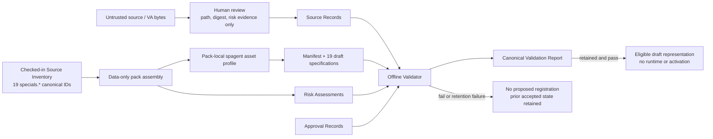

# Technical Design: Special Business Agents

## Overview

Special_Business_Agents defines a governed, data-only `specials` Domain_Pack at `business/specials/`. It represents exactly the 19 Source Inventory entries as draft JSON configuration and governance evidence. It does not implement, execute, register, activate, or otherwise operate agents. Source Markdown and VA materials are untrusted bytes: they may supply reviewed path, digest, and risk evidence, never executable instructions, credentials, service selections, tool permissions, or authority.

The design has two deliberately non-interchangeable namespaces:

- A **canonical Special_Agent ID** is only `specials.<agent-name>`, matching `^specials\.[a-z0-9]+(?:-[a-z0-9]+)*$`. It is used only for an `agent_id`, manifest/inventory entry, Source_Record binding, and canonical agent directory/path.
- A **Special_Agent_Asset reference** is only `spagent.<asset-name>`, matching `^spagent\.[a-z0-9]+(?:-[a-z0-9]+)*$`. It is used for `prompt_reference`, `rubric_reference`, every `critique_edges.inputs` and `critique_edges.outputs` value, and any future declared asset-reference field. An asset reference is never an agent ID, manifest/inventory ID, or directory identifier.

These namespaces are disjoint by construction. The pack is permanently draft, zero-tool, offline, and production-inactive. Approval records establish reviewed provenance and governance only; they cannot override the data-only profile. The shared schemas, Video_Pack, its manifest/inventory/configurations/114-agent count/validation rules, and every runtime integration remain unchanged.

### Local research findings and decisions

- [`business/schemas/agent-spec.schema.json`](../../../business/schemas/agent-spec.schema.json) is the structural baseline: it requires schema version `1.0`, data-only model and budget fields, prompt/rubric references, critique edges, and closed objects. Its prompt and rubric patterns are `video.*`, so it cannot directly validate the required `spagent.*` Special_Agent_Asset namespace.
- [`business/video/manifest.json`](../../../business/video/manifest.json) confirms the compatible relative specification-path convention `agents/<agent_id>/agent_spec.json`; it is read-only for this feature.
- The specified solution is a pack-local `business/specials/schemas/special-agent-spec.schema.json` profile. It preserves the baseline's data-only structural protections while fixing canonical IDs to `specials.*` and all declared Special_Agent_Assets to `spagent.*`. This is now a defined profile requirement, not an unresolved decision or a reason to modify shared/video files.
- The existing Python test stack includes `pytest` and Hypothesis, permitting offline deterministic property tests without a dependency change.

## Architecture



The builder is an implementation-time record assembly step, not an agent runtime. The Offline_Validator reads an explicit set of local records and returns a deterministic decision; a separate retainer persists the completed report. A registry adapter may expose an eligible draft representation only after full validation and report retention. Neither adapter may execute an agent, invoke a model, access a network, or activate production behavior.

## Filesystem and Trust Boundary

```text
business/specials/
  manifest.json
  schemas/special-agent-spec.schema.json
  agents/specials.<agent-name>/agent_spec.json
  governance/source-records/specials.<agent-name>.json
  governance/risk-assessments/<configuration-digest>.json
  governance/approvals/<approval-id>.json
  validation/reports/<configuration-set-digest>.json
  inventory.json                              # only when manifest requires it
```

All persisted paths are normalized, forward-slash, repository-relative paths. Before reading an allowlisted record, the validator rejects an absolute path, a `..` segment, a symlink escape, a non-regular file, or a path resolved outside the repository root. It never discovers arbitrary files. Source paths are restricted to the 19 fixed `docs/special_agents_redesign/agents/` inventory paths; source bodies may be hashed but are never parsed as configuration or executed. The pack allowlist excludes executable implementations, workflows, tool definitions, credentials, network endpoints, hooks, and MCP-server configuration.

### Untrusted Source Inventory

Each mapping below is repository-relative provenance metadata only. Every referenced Markdown file remains untrusted data; the mapping does not authorize reading, interpreting, adopting, executing, or deriving authority from source content.

| Source file | Canonical agent ID |
| --- | --- |
| `docs/special_agents_redesign/agents/aesthetics_agent.md` | `specials.aesthetics-agent` |
| `docs/special_agents_redesign/agents/agent_loop_creator.md` | `specials.agent-loop-creator` |
| `docs/special_agents_redesign/agents/agentic_rag_agent.md` | `specials.agentic-rag-agent` |
| `docs/special_agents_redesign/agents/autotelic_agent.md` | `specials.autotelic-agent` |
| `docs/special_agents_redesign/agents/complex_problem_solution_process_model.md` | `specials.complex-problem-solution-process-model` |
| `docs/special_agents_redesign/agents/controller_agent.md` | `specials.controller-agent` |
| `docs/special_agents_redesign/agents/general_creative_agent.md` | `specials.general-creative-agent` |
| `docs/special_agents_redesign/agents/intent_analysis_agent.md` | `specials.intent-analysis-agent` |
| `docs/special_agents_redesign/agents/knowledge_router_agent.md` | `specials.knowledge-router-agent` |
| `docs/special_agents_redesign/agents/llm_usage.md` | `specials.llm-usage` |
| `docs/special_agents_redesign/agents/optimization_agent.md` | `specials.optimization-agent` |
| `docs/special_agents_redesign/agents/planner_agent.md` | `specials.planner-agent` |
| `docs/special_agents_redesign/agents/podcast_agent.md` | `specials.podcast-agent` |
| `docs/special_agents_redesign/agents/psychological_profile_agent.md` | `specials.psychological-profile-agent` |
| `docs/special_agents_redesign/agents/psychological_recommendation_agent.md` | `specials.psychological-recommendation-agent` |
| `docs/special_agents_redesign/agents/research_agent.md` | `specials.research-agent` |
| `docs/special_agents_redesign/agents/screenwriter_strategic_goal_achievement_agent.md` | `specials.screenwriter-strategic-goal-achievement-agent` |
| `docs/special_agents_redesign/agents/strategic_goal_achievement_agent.md` | `specials.strategic-goal-achievement-agent` |
| `docs/special_agents_redesign/agents/techology_advisor_agent.md` | `specials.techology-advisor-agent` |

## Components and Interfaces
| Component | Inputs | Deterministic responsibility | Effect boundary |
| --- | --- | --- | --- |
| `SpecialsCatalog` | Fixed Source Inventory | Produces the lexically ordered, exact 19-member `specials.*` canonical ID set and `agents/<agent_id>/agent_spec.json` paths. | Does not read source content. |
| Pack-local schema profile | Candidate `agent_spec.json` | Enforces structural fields, `specials.*` canonical `agent_id`, `spagent.*` declared assets, draft status, empty tools, zero tool requests, local deterministic provider, disabled network access, and disabled production request. | Rejects unsupported, unsafe, or cross-namespace values. |
| Manifest/Inventory verifier | Manifest, specs, optional inventory | Confirms exact canonical membership, unique canonical IDs, canonical relative paths, and consistent draft authority values. Validates inventory only when `inventory_required` is true. | Any mismatch fails the whole attempted pack; no partial registration. |
| Provenance verifier | Source_Record, local source file when available, specification, Approval_Record | Checks allowlisted source path, source/configuration digests, canonical ID, approval linkage, and stale status. When references are absent, checks only committed governance evidence and does not fail for absence alone. | Stale or invalid provenance makes the affected candidate unavailable. |
| Risk-gate verifier | Risk_Assessment, Approval_Record, candidate spec | Checks every required risk/effect/requested-authority field, exact digest binding, human decision/reason, and approved-scope coverage. | No authority or representation derives from incomplete evidence. |
| `Offline_Validator` | Repository root and explicit local-file allowlist | Coordinates all checks and builds a canonical Validation_Report. | No network, subprocess, credential lookup, provider call, dynamic code execution, registration, or activation. |
| Report retainer | Completed report | Atomically stores the exact canonical report at its digest-derived path. | Retention is an effect gate only; it does not alter the completed validation outcome. |

### Pack-local profile and namespace contract

`special-agent-spec.schema.json` has schema version `1.0`, a local `$id`, and `additionalProperties: false` at the same closed-object boundaries as the shared baseline. It retains the baseline required fields: `schema_version`, `agent_id`, `status`, `role`, `allowed_tools`, `model_policy`, `budget_policy`, `prompt_reference`, `rubric_reference`, `critique_edges`, `max_refinement_count`, and `production_activation_requested`.

The profile uses two reusable, anchored definitions:

```text
CanonicalAgentId      = ^specials\.[a-z0-9]+(?:-[a-z0-9]+)*$
SpecialAgentAssetId   = ^spagent\.[a-z0-9]+(?:-[a-z0-9]+)*$
```

`agent_id` must match `CanonicalAgentId`. `prompt_reference`, `rubric_reference`, and every critique-edge input/output must match `SpecialAgentAssetId`; no `specials.*` value is valid in those asset positions. Any later profile field declared to hold a Special_Agent_Asset must reference the same `SpecialAgentAssetId` definition. The validator additionally rejects a matching `spagent.*` asset if it appears in any canonical-agent position, even if a generic string type would otherwise accept it.

The profile fixes `status` to `draft`, constrains `allowed_tools` to an empty unique array, fixes `budget_policy.max_tool_requests` to `0`, preserves `model_policy.provider = local_deterministic` and `network_access = false`, and fixes `production_activation_requested = false`. It does not edit the shared schema or any Video_Pack data.

### Validation interface

`validate_specials_pack(repository_root, allowlisted_paths) -> ValidationReport` is deterministic and local. The caller supplies the root and complete allowed-file set; an unallowlisted discovered file is rejected rather than implicitly read. The returned data is canonical JSON, not an exception-dependent protocol:

```json
{
  "format_version": "1.0",
  "validation_outcome": "pass | fail",
  "accepted_agent_ids": ["specials.example"],
  "rejected_agent_ids": ["specials.example"],
  "files": [{"path": "business/specials/manifest.json", "sha256": "<64 lowercase hex>", "schema": "pass | fail"}],
  "manifest": {"result": "pass | fail", "digest": "<64 lowercase hex>"},
  "inventory": {"required": false, "result": "not_required | pass | fail"},
  "provenance": {"result": "pass | fail"},
  "risk_gate": {"result": "pass | fail"},
  "report_retention": {"result": "retained | failed | not_attempted"},
  "registration_effect": "none | eligible_draft_representation",
  "findings": [{"category": "path | schema | asset_namespace | integrity | provenance | risk_gate | io", "path": "<relative path>", "code": "<stable code>"}],
  "configuration_set_digest": "<64 lowercase hex>"
}
```

Arrays are lexically sorted by canonical key. Objects use canonical UTF-8 JSON serialization. The report contains no run timestamp, random identifier, host-specific value, absolute path, or volatile field. Identical allowed-file bytes therefore produce byte-identical completed reports. `registration_effect` is `eligible_draft_representation` only when `validation_outcome` is `pass` and report retention succeeds; it never means runtime execution or production activation. If retention fails after validation completes, the report still records the computed validation outcome, returns/records the retention error where possible, and sets `registration_effect` to `none`.

### Validation sequence

1. Canonicalize and containment-check the explicit allowlist. Missing, unreadable, malformed, escaping, symlinked, or non-regular inputs receive sorted findings without reading an untrusted target.
2. Parse allowed JSON with a duplicate-key-rejecting decoder. Hash original bytes for file digests and canonical JSON for configuration and governance record digests.
3. Validate the local profile: schema version, fixed data-only fields, canonical `specials.*` `agent_id`, exact directory/path relation, and each declared `spagent.*` asset field. Reject any namespace crossover.
4. Derive the expected 19 canonical IDs from the fixed Source Inventory. Validate manifest, agent directories, and conditional inventory as one complete bijection before yielding an eligible ID.
5. Validate Source_Records. When an inventory source file is available, rehash only that allowlisted regular file; digest drift remains associated with the prior accepted state until manual re-validation. Manual re-validation marks drift stale and leaves the candidate draft and unavailable pending new risk/approval evidence. When reference directories are absent, validate only checked-in provenance records.
6. Validate Risk_Assessments and Approval_Records against exact candidate digests and the full declared scope. The approval must cover every present risk and requested tool, network, provider, lifecycle, and production value.
7. Aggregate and sort independent findings. A pack-integrity failure rejects the attempted pack and produces zero proposed registration; prior accepted state remains unchanged. Persist the completed report separately. Failure to retain it prevents every registration/activation effect without rewriting the completed validation result.

## Data Models

All records are UTF-8 JSON, schema-versioned, canonically serialized before record/configuration digest computation, and contain lowercase 64-character SHA-256 values where a digest is required. Records never persist source bodies, credentials, runtime URLs, executable instructions, or execution authority.

| Record | Required fields | Key invariants |
| --- | --- | --- |
| `AgentSpecification` | Baseline structural fields, including `schema_version`, `agent_id`, `status`, role, `allowed_tools`, policies, `prompt_reference`, `rubric_reference`, critique edges, refinement count, and production flag | `agent_id` and directory use only `specials.<agent-name>`; all declared assets use only `spagent.<asset-name>`; path is canonical; draft/zero-tool/local/no-network/no-production invariants hold. |
| `SpecialManifest` | `pack_id`, `agents`, `production_activation_requested`, `inventory_required` | `pack_id = specials`; exactly the 19 canonical `specials.*` IDs once each, lexically ordered; every entry has draft, empty tools, false activation request, and `agents/<agent_id>/agent_spec.json`. |
| `SpecialInventory` | `entries` | Exists only if required; one-to-one projection of the corresponding manifest canonical ID, status, and path. No `spagent.*` value is an entry ID. |
| `SourceRecord` | `schema_version`, `source_path`, `source_sha256`, `agent_id`, `configuration_sha256`, `reviewed_at`, `approval_id` | Path is a fixed Source Inventory path; canonical ID is `specials.*`; source/configuration digests bind reviewed bytes/specification; timestamp carries UTC offset; linked approval binds source path, digest, and canonical ID. |
| `RiskAssessment` | `schema_version`, configuration/source-record digests, nine potential-risk values, external-effect potential, requested tool authority/network/provider/activation values, requested lifecycle state | Every named risk is present/absent; effects are `none` or a deduplicated subset of allowed effects; absent requests explicitly record `none`; exactly one lifecycle state; no request changes profile constraints. |
| `ApprovalRecord` | `approval_id`, reviewer identity, decision, decision timestamp, configuration/source-record digests, approved risk scope, reason | Approval covers all present risks and requested values; reason is 1–1,024 characters; source binding matches path/digest/canonical `specials.*` ID; record is immutable. |
| `ValidationReport` | Interface fields, manifest digest, configuration-set digest | Canonical ordering, no volatile data, and local retention as evidence before any eligible-draft representation. |

### Digest and human-approval bindings

`configuration_sha256` is the SHA-256 of canonical `AgentSpecification` JSON. `source_record_sha256` is the SHA-256 of canonical `SourceRecord` JSON (there is no self-referential field). The Source_Record, Risk_Assessment, and ApprovalRecord configuration digests must agree; the latter two source-record digests must agree with the computed Source_Record digest. The approval's source binding must also agree with the record's normalized source path, source digest, and canonical `specials.*` agent ID.

A proposal begins unavailable. A complete Risk_Assessment and a matching human Approval_Record are mandatory even when every risk is absent. Any changed configuration digest, especially one proposing a tool, positive tool budget, network, non-local provider, non-draft lifecycle, or production request, needs new matching governance records. Passing that governance gate does not authorize the change: the local profile rejects every such authority increase and leaves the agent draft, offline, and inactive.

## Property-Based Testing Applicability

Property-based testing is appropriate for the validator's pure catalog, canonical/asset namespace distinction, path, schema, digest-binding, scope-coverage, and canonical-report functions. These have a large generated input space and no external dependency. Hypothesis tests use at least 100 examples, `derandomize=True`, `database=None`, local fixtures, and no network. Filesystem containment, source-directory absence, report retention, and Video_Pack preservation receive focused local integration tests.

## Property Reflection

The catalog, path, duplicate, membership, and namespace-substitution cases are one comprehensive bijection property rather than redundant tests. Schema validity, asset namespace validation, least-privilege closure, and atomic rejection are consolidated because an accepted specification must satisfy all of them at once. Manifest permutation/inventory projection remains separate because it proves order invariance across representations. Provenance linkage and stale-source transitions form one fail-closed property. Authority escalation remains distinct because it checks a transition from an approved draft baseline; its governance gate is necessary but never sufficient to defeat the local profile. Determinism/isolation is orthogonal. File-boundary, report-retention, and Video_Pack-preservation checks are integration cases, not PBT targets.

## Correctness Properties

*A property is a characteristic or behavior that should hold true across all valid executions of a system—essentially, a formal statement about what the system should do. Properties bridge approved requirements and machine-verifiable correctness guarantees.*

### Property 1: Canonical catalog bijection and namespace separation

For every generated subset, permutation, duplicate-containing arrangement, path, and candidate identifier, pack validation passes exactly when the manifest, agent directories, and required inventory contain the same set of all 19 `specials.<agent-name>` canonical IDs exactly once at their exact canonical paths; no `spagent.<asset-name>` value may substitute for a canonical ID.

**Validates: Requirements 1.1, 1.2, 1.3, 1.4, 3.1, 3.2, 3.3, 3.4**

### Property 2: Schema, asset namespace, and least-privilege closure

For every generated Agent_Specification, validation accepts it only when it satisfies schema version `1.0`, uses a matching canonical `specials.<agent-name>` agent ID, uses `spagent.<asset-name>` for every declared prompt, rubric, critique-edge, and other Special_Agent_Asset reference, and retains draft status, empty tools, zero tool requests, `local_deterministic` provider, disabled network access, and disabled production activation; any rejected mutation leaves prior registration unchanged.

**Validates: Requirements 2.1, 2.2, 2.3, 2.4, 2.5**

### Property 3: Manifest/specification and conditional-inventory consistency

For every generated valid Special_Manifest, configuration set, and conditional inventory, reordering entries does not change validation success, while altering a canonical ID, substituting an `spagent.*` asset value, relative path, status, allowed-tools value, or membership atomically produces an integrity failure and zero registration from the attempted pack.

**Validates: Requirements 2.1, 3.2, 3.3, 3.4**

### Property 4: Provenance invalidation is fail-closed

For every generated source/configuration digest pair and approval state, a Special_Agent is eligible for reviewed draft representation only when its Source_Record uses an allowlisted source path, matching lowercase SHA-256 digests, canonical `specials.*` ID, matching configuration, and matching approval; source digest drift preserves current approved/registration state until manual re-validation, while manual re-validation of the drift, unreadable present source, missing approval, or another failed provenance condition produces no authority.

**Validates: Requirements 4.1, 4.2, 4.3, 4.4, 4.5, 4.6, 5.3, 5.4, 5.5, 5.6**

### Property 5: Authority escalation requires renewed approval and still fails the profile

For every approved draft configuration and every generated authority-increasing mutation—non-empty tools, positive tool budget, enabled network, non-local provider, non-draft status, or production request—the governance gate is satisfied only by a new Risk_Assessment and Approval_Record bound to the mutated configuration/source-record digests with complete approved scope; full pack validation nevertheless rejects the mutation under the immutable data-only profile and preserves the prior state.

**Validates: Requirements 2.2, 2.3, 2.4, 2.5, 5.1, 5.2, 5.3, 5.4, 5.5, 5.6**

### Property 6: Offline validator determinism and isolation

For any fixed explicitly allowlisted regular local fixture tree, two validation runs produce byte-equivalent canonically ordered Validation_Reports with no volatile fields and make no network, subprocess, credential, provider, or source-code-execution attempt; absent reference directories alone do not change a checked-in-evidence result, and report-retention failure preserves the completed validation outcome while producing zero registration or activation effect.

**Validates: Requirements 6.1, 6.2, 6.3, 6.4, 6.5, 6.6**

## Error Handling

The validator accumulates non-secret, stable findings rather than stopping at the first independent error. A finding contains a category, repository-relative path when available, stable code, and affected canonical ID when derivable. It never emits source material, credentials, or sensitive source text. A failed validation produces no proposed registration or activation and preserves any previously accepted representation.

| Condition | Safe outcome | Recovery boundary |
| --- | --- | --- |
| Absolute/traversing/escaping/non-regular path | `path` finding; do not read target; reject attempted pack. | Correct the checked-in relative allowlist path. |
| Malformed, duplicate-keyed, unreadable, unsupported, or schema-invalid JSON | `schema` or `io` finding; reject affected ID and attempted registration. | Replace only the invalid data record. |
| `specials.*` in an asset field, `spagent.*` in a canonical field, or malformed asset ID | `asset_namespace` finding; no authority or registration. | Use the correct namespace and revalidate. |
| Catalog/manifest/spec/inventory mismatch or duplicate | `integrity` finding; no partial registration. | Restore the exact 19-ID canonical projection. |
| Unsafe status/tool/provider/network/budget/activation value | `schema` or `least_privilege` finding; approval cannot bypass it. | Return to the immutable draft-only profile. |
| Missing, stale, or mismatched source/governance evidence | `provenance` or `risk_gate` finding; candidate unavailable. | Add new digest-bound risk assessment and human approval after review. |
| Reference directories absent | No finding solely for absence; use checked-in evidence. | Restore them only to review new source bytes. |
| Report retention failure after checks complete | Retention failure is reported; completed `validation_outcome` remains unchanged, but `registration_effect` is `none`. | Restore local evidence storage and rerun. |

## Testing Strategy

No product code is implemented in this design phase. The future implementation uses the existing Python stack (`pytest==8.3.5`, `hypothesis==6.131.12`) without new dependencies. Pure validator properties reside in `backend/tests/properties/`; local containment, isolation, retention, and Video_Pack sentinel cases reside in `backend/tests/integration/`. Proposed implementation code is local only (for example, `backend/app/business/specials_validator.py`) and creates no agent runtime.

- Each property has one Hypothesis test with at least 100 examples, `derandomize=True`, and `database=None`, marked by `Feature: special-business-agents, Property N: <property title>`.
- Generators produce canonical `specials.*` IDs separately from `spagent.*` asset values, then deliberately cross them, vary malformed kebab-case names, paths, digests, scopes, ordering, and authority fields. They never generate source instructions for execution.
- Fixtures use temporary local repository trees and fixed UTF-8 bytes. Sentinels/spies fail tests on socket/network, subprocess, credential lookup, provider call, or dynamic code execution. Assertions compare report bytes and pre/post input and registration state.
- Example tests cover the exact 19-ID catalog, profile field examples, both namespace regex boundaries, draft activation denial, approval reason lengths 1 and 1,024, and not-required inventory. Integration tests cover symlink containment where supported, absent references, report-retention failure, data-only file allowlists, and pre/post Video_Pack hashes/count/rules.
- Focused one-shot commands run from `backend/`: `python -m pytest -q tests/properties -k special_business_agents` and `python -m pytest -q tests/integration -k special_business_agents`. Tests are offline; no watcher, development server, or remote request is permitted.

| Requirements | Primary coverage |
| --- | --- |
| 1.1–1.4, 3.1–3.4 | Property 1 and Property 3, including canonical/asset namespace crossover. |
| 1.5, 3.5 | Focused data-only allowlist and Video_Pack immutability integration fixtures. |
| 2.1–2.5 | Property 2 and Property 5, including `spagent.*` prompt/rubric/critique assets. |
| 4.1–4.6, 5.1–5.6 | Property 4 and Property 5 with digest, provenance, risk-scope, and approval fixtures. |
| 6.1–6.6 | Property 6 plus isolation, absent-reference, and retention integration fixtures. |

Passing tests are evidence, not a substitute for the human source/provenance and risk/approval gates.

## Approval and Open Decision Record

| Decision | Status | Rationale / required review |
| --- | --- | --- |
| Create only `business/specials/` data records and local evidence | Required | Keeps the feature data-only, offline, fail-closed, and without runtime/network behavior. |
| Retain fixed 19 canonical `specials.*` IDs and canonical paths | Required | The Source Inventory is authoritative for identity; implementation review confirms the exact catalog. |
| Use the specified pack-local schema profile with `spagent` asset regexes | Specified — conformance review required | The profile fixes canonical `agent_id` values to `specials.*` and prompt/rubric/critique/other declared assets to `spagent.*`, while preserving closed, data-only baseline constraints. It requires no shared-schema or Video_Pack change. |
| Treat source/VA material as untrusted and retain reviewed provenance only | Required human provenance gate | A matching Source_Record and Approval_Record are mandatory before source-derived representation; changed digests require manual re-validation. |
| Retain digest-bound Risk_Assessments and Approval_Records | Required human risk gate | A reviewer must approve complete matching scope for every present risk and requested value; approval cannot permit profile violations. |
| Use property tests plus local integration/snapshot checks | Proposed implementation evidence | Covers pure invariants, namespace separation, file boundaries, and offline isolation deterministically. |

There is no remaining schema-namespace ambiguity: `specials.*` is exclusively canonical-agent identity and `spagent.*` is exclusively Special_Agent_Asset identity. Before implementation, reviewers must confirm conformance to the specified profile and complete the per-configuration provenance and human risk/approval gates. If a new asset type or required authority is proposed, return to requirements clarification; do not broaden the profile or relax the data-only constraints by interpretation.
